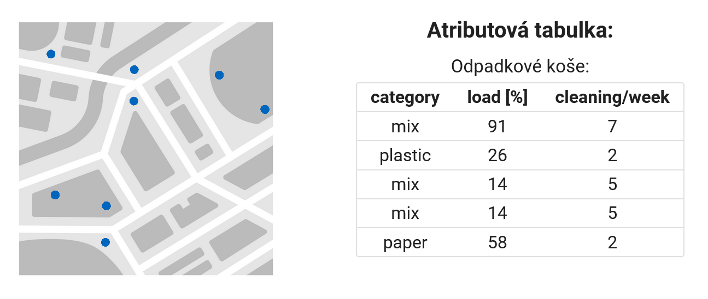
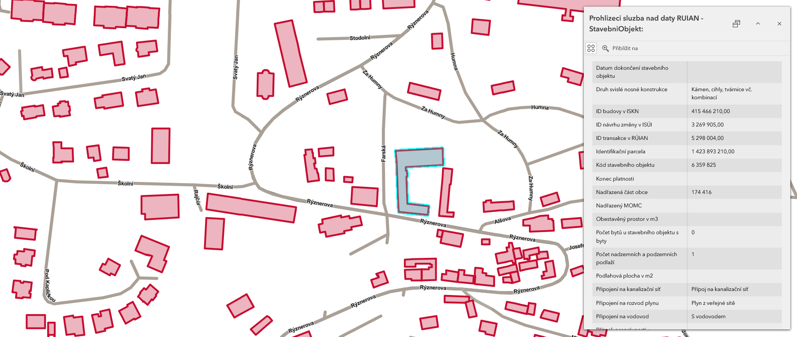
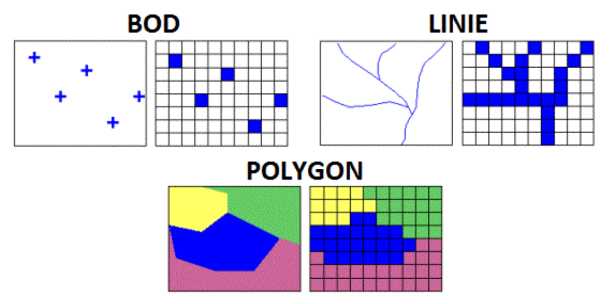
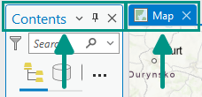
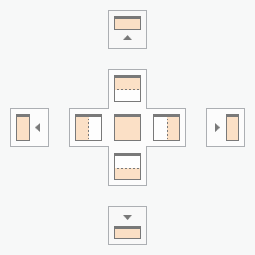
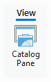
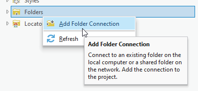
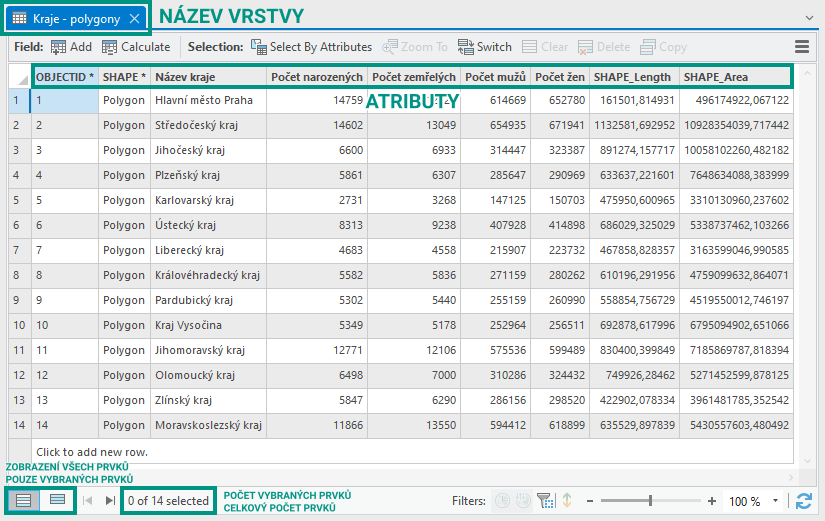
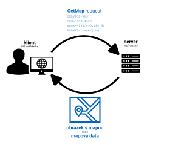

# Úvod do ArcGIS Pro, prostorová data a datové zdroje

## Cíle cvičení

<div class="grid cards grid_icon_info smaller_padding" markdown>

-   :material-monitor-dashboard:{ .xl }

    __základní orientace__ v prostředí ArcGIS Pro a v projektu GIS

-   :material-vector-polyline:{ .xl }

    rozlišení __vektorových__ a __rastrových__ dat

-   :material-table:{ .xl }

    práce s __atributovou tabulkou__ a návrh atributů

-   :material-server-network:{ .xl }

    rozlišení __lokálních dat__, dat ke stažení a __webových mapových služeb__

-   :material-database-plus:{ .xl }

    práce s __Catalogem__, vytvoření geodatabáze a uspořádání vlastních dat

</div>

<hr class="level-1">

## Prostorová data
Prostorová data (geodata) jsou data, která obsahují informaci o konkrétní geografické poloze objektů na Zemi. Poloha může být přímo (souřadnice objektu) či nepřímo (např. adresou). Informace o poloze obvykle bývá doplněna o informaci vlastnostech *(atributech)* objektu, která jsou uložena v atributové tabulce. Dva nejběžnější datové formáty používané k ukládání (geo)prostorových dat jsou vektorové (body, linie, plochy) a rastrové (satelitní snímky, digitální modely terénu).

???+ note-fg-color "Atributy (geo)prostorových dat"

    Podstatnou částí geoprostorových dat jsou atributy. Jedná se o __doplňkové informace přiřazené ke každému prvku__ a uspořádané ve formě tzv. __atributové tabulky__. Sloupce této tabulky jsou tzv. __:octicons-columns-16: atributy__, řádky jsou tzv. __:octicons-rows-16: záznamy__. Každý atribut má svůj název a datový typ (např. celé číslo, des. číslo, text, datum). V záznamu nemusí být nutně vyplněny všechny atributy (záleží na nastavení databáze).

    {width=50% .no-filter}
    {align="center"}

    Zobrazování atributů konkrétního prvku probíhá nejčastěji formou tzv. __vyskakovacího okna__ (pop-up window). Tento prvek uživatelského rozhraní se __objeví po kliknutí na prvek v mapě__ a ve výchozím stavu zobrazuje __tabulku s atributy pro daný prvek__.  Atributy se v geomatice používají pro __filtrování prvků__ (zobrazení/skrytí) nebo __řízení symbologie__ (např. obarvení budov podle počtu podlaží).

    {width=50% .no-filter}
    {align="center"}

    <figcaption>vyskakovací okno (po kliknutí na prvek)</figcaption>

 

    <iframe width="100%" height="400" frameborder="0" scrolling="no" marginheight="0" marginwidth="0" src="https://experience.arcgis.com/experience/0d0ade6e797e419d8e73fd28b8704c5a"></iframe>

<!--
style="border: .05rem solid #ededed; border-radius: .1rem;"-->

???+ note-fg-color "Vektorová vs. rastrová data"
    <div class="grid cards" markdown>

    -   :material-vector-polyline:{ .lg .middle } __Vektorová data__

        ---

        Reprezentují prvky reálného světa pomocí základních geometrických elementů: __bodů, linií a ploch__ (tzv. polygonů):
            
        - body: stromy, zastávky, měřicí stanice;
        - linie: komunikace, vodní toky, inženýrské sítě;
        - polygony: parcely, budovy, plochy zeleně, chráněná území.

        Podrobnost dat je určena __podrobností souřadnic vrcholů__ geometrického prvku

        Vhodné pro modelování a analýzu __diskrétních objektů__ (např. poloha bodů, kategorie pokrytí půdy)

        Vhodné pro __tvorbu map, měření délek, geometrické výpočty__

        Možné problémy s __topologií__ (mezery a překryvy)

        Základními formáty vektorových dat jsou __Esri Shapefile, GeoJSON, GeoPackage__ či __KML/GML__


    -   :material-grid:{ .lg .middle } __Rastrová data__

        ---

        Reprezentují prvky reálného světa v podobě pravidelné mřížky tvořené tzv. __pixely__ (z angl. *picture element*)

        - ortofoto a satelitní snímky;
        - digitální model reliéfu;
        - teplota, srážky nebo znečištění ovzduší.

        Podrobnost dat je určena __prostorovým rozlišením__ rastru, tj. __velikostí jedné buňky__ v terénu (v metrech)

        Vhodné pro modelování a analýzu __spojitých jevů__ (nadmořská výška, teplota, srážky)
        
        Využívané pro __obrazová data__ (např. satelitní snímky)

        Nevýhodou velikost souborových dat

        Základními formáty rastrových dat jsou __GeoTIFF, JPEG, PNG__ či __GIF__


    </div>

    <figure markdown>
    { width=400px }
    <figcaption>Rozdíl v grafické reprezentaci vektorových a rastrových dat (Geletič et al. 2019)</figcaption>
    </figure>


!!! note-grey "Souřadnicové systémy"

    Aby bylo možné kombinovat data z více zdrojů, musí GIS znát jejich polohu a souřadnicový systém. Souřadnicovým systémům, transformacím a jejich praktickému využití se bude věnovat následující cvičení.


<hr class="level-1">

## GIS projekt: mapa, vrstvy a data

V tomto kurzu budeme pracovat především v programu **ArcGIS Pro**. GIS projekt si lze představit jako pracovní prostor, ve kterém jsou uspořádány mapy, vrstvy, tabulky, rozvržení map a odkazy na data. Projekt tedy obvykle **neobsahuje všechna data**, ale ví, kde jsou data uložena nebo odkud jsou dostupná.


**Vzorová data:**
    
[:material-download: DATA :material-layers:](https://k155cvut.github.io/ygis/assets/cviceni1/cv01_data.zip){ .md-button .md-button--primary .button_smaller } 
{: .button_array style="justify-content:flex-start;"}

V prostředí ArcGIS Pro budeme rozlišovat zejména tyto pojmy:

<div class="table_headerless table_small_padding table_centered" markdown>
| | |
| - | - |
| __Projekt__ | soubor a pracovní prostředí ArcGIS Pro; uchovává mapy, seznam vrstev, symbologii a připojení k datům |
| __Mapa__ | 2D pohled, ve kterém kombinujeme vrstvy nad společným územím |
| __Vrstva__ | způsob, jakým jsou konkrétní data zobrazena v mapě; určuje například symboliku, viditelnost a pop-up |
| __Dataset__ | organizovaná sada dat uložená v souboru, geodatabázi nebo na serveru |
| __Prvek__ | jednotlivý objekt ve vektorové vrstvě, například strom, komunikace nebo parcela |
| __Atribut__ | vlastnost prvku uložená v atributové tabulce, například název, typ, plocha nebo datum |
</div>

!!! note-grey "Důležité"

    **Uložení projektu není totéž jako uložení dat.** Uložení projektu zachová například mapu, její vrstvy a jejich vzhled. Úpravy atributů nebo geometrie je nutné ukládat zvlášť na kartě _:material-tab: Edit_ → _:material-button-cursor: Save_.

## Základní orientace v ArcGIS Pro

Uživatelské prostředí programu se skládá zejména z těchto částí:

<div class="table_headerless table_small_padding table_centered" markdown>
| | |
| - | - |
| __Ribbon__ | pás karet s nástroji; nabídka se mění podle aktuální činnosti |
| __Contents Pane__ | obsah aktivní mapy: vrstvy, jejich pořadí, viditelnost a vlastnosti |
| __Catalog Pane__ | přehled projektu a připojených složek, geodatabází, serverů a dalších zdrojů |
| __Map View__ | mapové okno pro práci s 2D mapou |
| __Pane__ | dokovatelný panel pro vlastnosti vrstev, symbologii, geoprocessing aj. |
</div>



{: .process_container}

<figcaption>Panely ArcGIS Pro lze libovolně přemisťovat a přichytávat k okrajům programu.</figcaption>

### Ovládání mapy

Pro základní pohyb v mapě slouží nástroj _:material-cursor-default-click: Explore_. Umožňuje posun, změnu měřítka, identifikaci prvků a otevření pop-upu po kliknutí na prvek. V panelu _Contents_ lze měnit pořadí vrstev, jejich viditelnost a průhlednost.

!!! tip "Zásada pro čitelnost mapy"

    Rastrové podklady a plochy obvykle patří níže v pořadí vrstev. Linie, body a popisky bývají nad nimi. Změna pořadí vrstev nemění data, pouze jejich vykreslení v mapě.

<hr class="level-1">


## Catalog: uspořádání a příprava vlastních dat

Panel _Catalog_ slouží k procházení a správě zdrojů, se kterými projekt pracuje. Najdeme zde mimo jiné připojené složky, geodatabáze, nástroje a připojení k serverům.

### Připojení složky

Adresář s daty je vhodné k projektu připojit. V _Catalog Pane_ klikněte pravým tlačítkem na _Folders_ → _:material-form-dropdown: Add Folder Connection_ a vyberte složku s daty. Připojení usnadní opakované přidávání dat do mapy.


{: .off-glb .process_icon}

{: .process_container}

### Vytvoření souborové geodatabáze

1. V _Catalog Pane_ otevřete _Databases_.
2. Klikněte pravým tlačítkem → _:material-database-plus: New File Geodatabase_.
3. Geodatabázi pojmenujte stručně a bez mezer či diakritiky, například `projekt_prijmeni.gdb`.
4. Geodatabázi připojte k projektu a používejte ji jako hlavní pracovní úložiště vlastních dat.

### Feature dataset

**Feature dataset** je kontejner uvnitř geodatabáze pro související vektorové vrstvy. Vrstvy v jednom feature datasetu musí používat stejný souřadnicový systém. Tato vlastnost je důvodem, proč se k jeho založení vrátíme i v následujícím cvičení.

Pro vytvoření feature datasetu klikněte pravým tlačítkem na geodatabázi → _:material-folder-plus: New_ → _:material-folder: Feature Dataset_. Do dialogu zadejte název a převezměte nebo zvolte souřadnicový systém referenčních dat použitých ve cvičení.

!!! tip "Doporučená struktura"

    ```text
    projekt_prijmeni.gdb
    └── zakladni_data
        ├── zajmove_uzemi
        ├── komunikace
        └── body_zajmu
    ```

### Export dat do geodatabáze

Data z externího souboru nebo služby lze uložit do vlastní geodatabáze. V _Contents Pane_ klikněte pravým tlačítkem na vrstvu → _:material-export: Data_ → _:material-export: Export Features_. Jako výstupní umístění vyberte vytvořenou geodatabázi, případně konkrétní feature dataset.

Před exportem ověřte:

- zda exportujete správný rozsah prvků;
- zda vrstva obsahuje očekávané atributy;
- zda je vhodné zachovat všechny atributy;
- kam budou data uložena a jak se bude výstupní vrstva jmenovat;
- zda je u dat dovoleno vytvářet lokální kopii podle jejich licence.

<hr class="level-1">


## Atributová tabulka

Atributová tabulka propojuje geometrii prvku s jeho popisem. Ve vektorové vrstvě zpravidla odpovídá jeden **řádek** tabulky jednomu prvku v mapě. **Sloupce** tabulky jsou atributová pole.


{: .process_container}

<figcaption>Atributová tabulka v ArcGIS Pro.</figcaption>

Atributovou tabulku otevřete v panelu _Contents_ kliknutím pravým tlačítkem na vrstvu → _:material-form-dropdown: Attribute Table_. Výběr prvku v mapě se okamžitě projeví i v tabulce a naopak.

### Datové typy atributů

Datový typ určuje, jaké hodnoty lze do pole ukládat. Typ pole je vhodné zvolit před zahájením editace; změna datového typu již existujícího pole nebývá možná přímo.

<div class="table_headerless table_small_padding table_centered" markdown>
| Datový typ | Použití | Příklad |
| - | - | - |
| __Short__ | menší celé číslo | počet podlaží, kód kategorie |
| __Long__ | celé číslo ve větším rozsahu | počet obyvatel, identifikátor |
| __Float__ | desetinné číslo s běžnou přesností | orientační sklon, index |
| __Double__ | desetinné číslo s vyšší přesností | výměra, výška, souřadnicová hodnota |
| __Text__ | textový řetězec | název, adresa, poznámka |
| __Date__ | datum a případně čas | datum měření, datum aktualizace |
</div>

Pro hodnotu typu **ano / ne** se často používá pole typu _Short_ s hodnotami `0` a `1`, případně doména povolených hodnot. Podrobnější nastavení datové integrity, domén a subtypů budeme řešit později.

!!! note-grey "Systémová pole"

    Pole jako `OBJECTID`, `Shape` nebo `Shape_Length` mají zvláštní význam pro databázi a program je spravuje automaticky. Běžně je nelze odstranit ani ručně upravovat.

### Pop-up: rychlé čtení atributů v mapě

Kliknutím na prvek nástrojem _:material-cursor-default-click: Explore_ se otevře **pop-up**. Ve výchozím nastavení nabízí přehled atributů vybraného prvku. Pop-up je vhodný pro rychlou orientaci; atributová tabulka pak pro systematickou práci s více záznamy.

<hr class="level-1">

## Kde jsou data uložena a jak je získat

Data v GIS nemusí být vždy souborem uloženým na počítači. Stejnou vrstvu lze přidat z lokálního disku, síťového úložiště, otevřeného datového portálu nebo přímo z webové služby.

<div class="table_headerless table_small_padding table_centered" markdown>
| Způsob přístupu | Co připojujeme | Příklady | Kdy je vhodný |
| - | - | - | - |
| __Lokální data__ | cestu k souboru nebo geodatabázi | GeoPackage, Shapefile, file geodatabase, GeoTIFF | vlastní editace, analýza, archivace |
| __Data ke stažení__ | nejprve soubor stáhneme, pak s ním pracujeme lokálně | otevřená data obce, AOPK, ČSÚ | práce s konkrétní verzí dat, offline práce |
| __Webová služba__ | URL služby; data zůstávají na serveru poskytovatele | ArcGIS REST, WMS, WFS | aktuální referenční vrstvy, sdílení, rychlé přidání dat |
</div>

### Lokální data a běžné formáty

- **Souborová geodatabáze (`.gdb`)** — doporučený pracovní formát ArcGIS Pro. Do jedné geodatabáze lze ukládat více vrstev, tabulek a dalších datasetů.
- **Shapefile** — starší vektorový formát tvořený několika soubory. Při kopírování nebo přesouvání je nutné zachovat všechny soubory se stejným názvem.
- **GeoPackage (`.gpkg`)** — otevřený databázový formát, který může obsahovat vektorová i rastrová data v jednom souboru.
- **GeoJSON / KML / GML** — běžné výměnné formáty pro vektorová data.
- **GeoTIFF** — častý formát rastrových dat, například ortofota či digitálního modelu reliéfu.
- **CSV / XLSX** — tabulkové soubory. Mohou obsahovat souřadnice nebo adresy, ze kterých lze později vytvořit prostorové prvky.

!!! warning "Pozor při kopírování dat"

    Nezaměňujte soubor s jeho zobrazením v mapě. Vrstva v projektu může odkazovat na data na disku, na fakultním síťovém úložišti nebo na serveru. Před přesunem či odevzdáním projektu vždy ověřte, zda budou zdrojová data na cílovém místě dostupná.


### Mapové služby

Mapové služby jsou __webové nástroje poskytující geoprostorová data__ ze serveru na klienta __prostřednictvím internetu__. Klientem je (zjednodušeně) zařízení uživatele (např. webový prohlížeč) vysílající požadavek pro získání dat ze serveru. V praxi se většinou __klient služby dotazuje pomocí GIS aplikace__ (webové či desktopové), která na pozadí posílá serveru požadavky a následně zobrazuje přijatá data (viz obrázek). Díky vazbě dat na souřadnicový systém lze takto __kombinovat data s různými rozsahy a z různých zdrojů v jednom mapovém okně__ a data se zobrazí polohově správně.

{ .no-filter width=700px}
{align=center}

V prostředí Esri se často setkáte se službami publikovanými přes **ArcGIS Server** nebo **ArcGIS Online**. V praxi je užitečné rozlišovat zejména:

- **Feature service** — poskytuje vektorové prvky a jejich atributy; podle oprávnění je lze prohlížet, dotazovat nebo editovat.
- **Map image service** — poskytuje serverem vykreslený mapový obraz; hodí se pro rychlé prohlížení kartograficky připravených map.
- **Image service** — zpřístupňuje rastrová data, například snímky nebo model reliéfu.
- **WMS** — otevřený standard pro sdílení geografické informace ve formě rastrových dat
- **WFS** — otevřený standard sdílení geografické informace ve formě vektorových dat 


???+ note-fg-color "Kde hledat mapové služby?"
    - geoportály:
    
        - [Geoportál ČÚZK](https://geoportal.cuzk.cz/){.color_def .underlined_dotted .external_link_icon target="_blank"}, [Národní geoportál INSPIRE](https://geoportal.gov.cz/web/guest/home/){.color_def .underlined_dotted .external_link_icon target="_blank"}, [Geoportál Praha](https://geoportalpraha.cz/){.color_def .underlined_dotted .external_link_icon target="_blank"}, [Geoportál ČSÚ](https://geodata.statistika.cz/){.color_def .underlined_dotted .external_link_icon target="_blank"}, [Geoportál města Brna](https://data.brno.cz/){.color_def .underlined_dotted .external_link_icon target="_blank"}.
    - webové stránky poskytovale
        - [Evropská agentura pro životní prostředí (EEA)](https://land.copernicus.eu/en/products/corine-land-cover?tab=main){ .color_def .underlined_dotted .external_link_icon target="_blank"}, [Otevřená data AOPK ČR](https://gis-aopkcr.opendata.arcgis.com/){ .color_def .underlined_dotted .external_link_icon target="_blank"}, [Česká geologická služba](https://cgs.gov.cz/mapy-a-data/webove-sluzby){ .color_def .underlined_dotted .external_link_icon target="_blank"}
    

??? note-fg-color "Co je geoportál?"

    **Geoportály** jsou webové platformy, které poskytují přístup k geografickým datům a službám. Slouží jako centrální bod pro vyhledávání, prohlížení a stahování prostorových informací, jako jsou mapy, letecké snímky, katastrální data nebo údaje o životním prostředí. Mohou představovat cenný zdroj dat pro analýzu a plánování projektů. Lze zde například využít data o reliéfu terénu, dopravní infrastruktuře nebo vlastnických vztazích k pozemkům. Geoportály často nabízejí i nástroje pro prostorovou analýzu a vizualizaci dat, což může pomoci lépe porozumět kontextu projektů.
    <br>

    Geoportály v širším slova smyslu představují také důležitý nástroj v územním plánování a správě měst. Umožňují veřejnosti i odborníkům přístup k aktuálním a relevantním informacím o daném území. Uživatelé mohou využít geoportály k získání podkladů pro své projekty, ale také k prezentaci svých návrhů veřejnosti. Díky geoportálům se stává územní plánování transparentnější a efektivnější, což přispívá k lepšímu rozvoji měst a regionů.


??? note-fg-color "Co je ArcGIS Online?"

    [__ArcGIS Online__](https://www.arcgis.com/){.color_def .underlined_dotted .external_link_icon target="_blank"} je cloudová platforma pro geografické informační systémy od společnosti Esri. Umožňuje uživatelům vytvářet, sdílet a analyzovat mapy a geografická data prostřednictvím webového prohlížeče. **ArcGIS Online** představuje cenný nástroj pro vizualizaci a analýzu prostorových dat, jako mohou být urbanistické plány, dopravní sítě, demografické údaje nebo informace o životním prostředí. Platforma nabízí širokou škálu nástrojů pro tvorbu interaktivních map, 3D modelů a webových aplikací, které mohou být využity při plánování a prezentaci projektů. 


    Díky **ArcGIS Online** mohou uživatelé snadno integrovat různé zdroje dat, provádět prostorové analýzy a vytvářet vizuálně atraktivní prezentace svých návrhů. Platforma také podporuje spolupráci a sdílení dat mezi uživateli, což umožňuje studentům a pedagogům efektivněji pracovat na společných projektech. ArcGIS Online je tak vhodným nástrojem pro moderní geografické vzdělávání, který studentům umožňuje rozvíjet dovednosti v oblasti prostorové analýzy a vizualizace.

!!! note-grey "Prohlížečka není zdroj dat!"

    ArcGIS Online nebo ArcGIS Pro jsou aplikace, ve kterých data vyhledáváme a zobrazujeme. Při práci s daty vždy zjišťujeme jejich **poskytovatele, název vrstvy, datum aktualizace, licenci a metadata**. Tyto informace jsou důležité pro posouzení použitelnosti dat i pro uvedení zdroje ve výstupech projektu.


<hr class="level-1">


## Shrnutí

Po tomto cvičení byste měli umět:

- rozlišit projekt, mapu, vrstvu, dataset, prvek a atribut;
- orientovat se v základních částech ArcGIS Pro;
- určit, zda jsou data vektorová nebo rastrová;
- otevřít atributovou tabulku, číst ji a zvolit vhodný základní datový typ;
- vysvětlit rozdíl mezi lokálně uloženým souborem a webovou mapovou službou;
- připojit složku v Catalogu, vytvořit file geodatabase a exportovat do ní vrstvu;
- dohledat poskytovatele a metadata použité datové vrstvy.

---

__Doplňkové zdroje:__
{: align=center }

[<span>pro.arcgis.com</span><br>Introduction to ArcGIS Pro](https://pro.arcgis.com/en/pro-app/latest/get-started/get-started.htm){ .md-button .md-button--primary .server_name .external_link_icon_small target="_blank"}
[<span>pro.arcgis.com</span><br>ArcGIS field data types](https://pro.arcgis.com/en/pro-app/latest/help/data/geodatabases/overview/arcgis-field-data-types.htm){ .md-button .md-button--primary .server_name .external_link_icon_small target="_blank"}
[<span>pro.arcgis.com</span><br>Connect to a folder](https://pro.arcgis.com/en/pro-app/latest/help/projects/connect-to-a-folder.htm){ .md-button .md-button--primary .server_name .external_link_icon_small target="_blank"}
[<span>pro.arcgis.com</span><br>What is a feature dataset?](https://pro.arcgis.com/en/pro-app/latest/help/data/geodatabases/overview/feature-dataset-basics.htm){ .md-button .md-button--primary .server_name .external_link_icon_small target="_blank"}
{: .button_array}
