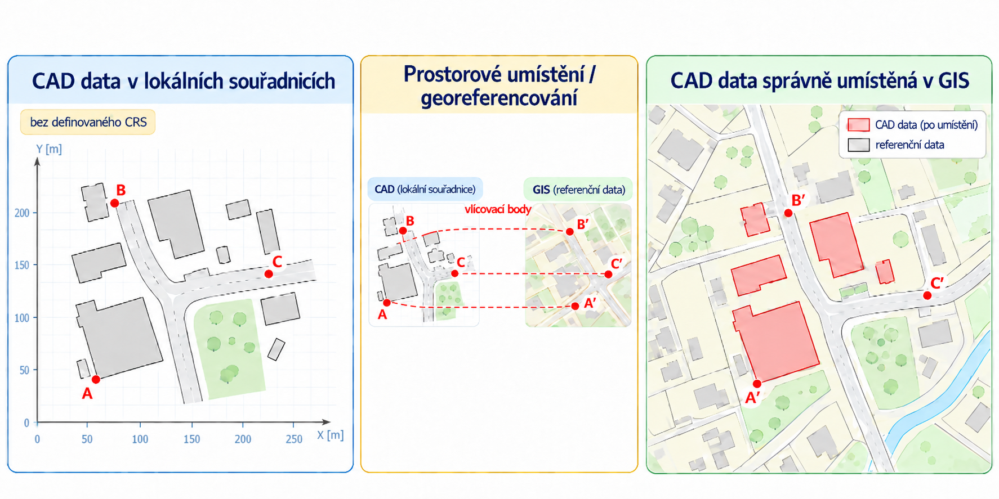
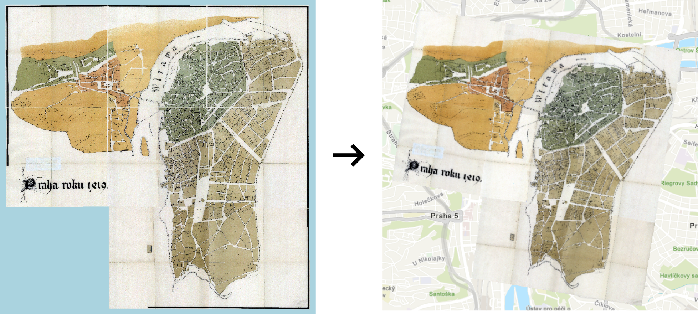
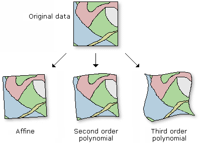
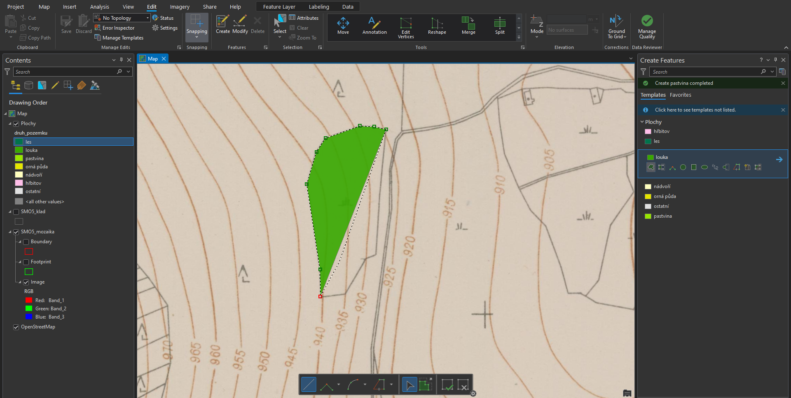

# Souřadnicové systémy, souřadnicové připojení dat
## Cíle cvičení

-   :material-axis-arrow:{ .xl }

    vysvětlit, proč má každá vrstva **souřadnicový referenční systém (CRS)**

-   :material-map-marker-radius:{ .xl }

    rozpoznat běžné **souřadnicové systémy používané v Česku** a ověřit je v ArcGIS Pro

-   :material-ruler-square:{ .xl }

    **importovat a prostorově umístit CAD data** v prostředí ArcGIS Pro

-   :material-image-marker:{ .xl }

    **prostorově umístit rastrová data**

## Proč nestačí, že vrstva „je na správném místě“

**VZOROVÁ DATA:**

- [:material-download: DATA :material-layers:](../assets/cviceni2/cv02_data.zip){ .md-button .md-button--primary .button_smaller } 

Každý prostorový prvek má geometrii uloženou jako souřadnice. Aby GIS věděl, **co čísla znamenají a kde je má zobrazit**, potřebuje znát souřadnicový referenční systém (**CRS**, dříve také SRS). CRS určuje zejména vztažný systém, způsob zobrazení zemského povrchu do roviny, jednotky a pořadí os.

- **Geografický CRS** pracuje se zeměpisnou šířkou a délkou, tedy zpravidla ve stupních.
- **Projektovaný CRS** převádí polohu do roviny; souřadnice pak obvykle vyjadřujeme v metrech. Je vhodný pro práci s délkou, plochou a vzdáleností v území.

!!! note-grey "Důležitá zásada"

    Stejná lokalita může mít v různých CRS různé číselné souřadnice. Neznamená to, že leží na jiném místě. Chyba vznikne tehdy, když je CRS vrstvy **neznámý nebo nesprávně přiřazený**.

### Běžné CRS pro práci v Česku

| Souřadnicový systém | EPSG | Jednotky | Typické hodnoty souřadnic na území ČR | Kde se s ním setkáme |
| - | -: | - | - | - |
| **S-JTSK / Krovak East North** | **5514** | metry | přibližně `Y = −900 000 až −400 000`; `X = −1 250 000 až −900 000` | státní mapová díla, katastr nem., velká část domácích dat |
| **ETRS89 / UTM 33N** | **3045** | metry | přibližně `E = 440 000 až 520 000`; `N = 5 400 000 až 5 650 000` | evropská data v západní a střední části ČR |
| **ETRS89 / UTM 34N** | **3046** | metry | přibližně `E = 360 000 až 440 000`; `N = 5 400 000 až 5 650 000` | evropská data ve východní části ČR |
| **WGS 84** | **4326** | stupně | přibližně `14–19° E`; `48,5–51,1° N` | GPS, souřadnice z terénu, webové formuláře, jiné mapové portály |
| **WGS 84 / Pseudo-Mercator (Web Mercator)** | **3857** | metry | přibližně `X = 1 550 000 až 2 110 000`; `Y = 6 200 000 až 6 650 000` | podkladové mapy a webové mapové služby |

!!! warning "UTM není v celé ČR jedna zóna"

    Česká republika zasahuje do zón **33N a 34N**. Před použitím UTM je nutné ověřit, kterou zónu daná data používají. Zkratka „UTM“ sama o sobě není úplný název CRS.

### Kontrola CRS v ArcGIS Pro

1. V panelu _Contents_ klikněte pravým tlačítkem na vrstvu → _:material-cog: Properties_{: .outlined_code}.
2. Na kartě _Source_ ověřte položku **Spatial Reference**.
3. CRS aktivní mapy ověřte v _:material-map: Map Properties_{: .outlined_code} → _Coordinate Systems_{: .outlined_code}.
4. Uložte si zejména **název CRS a EPSG kód**; oba údaje musí být součástí popisu dat, která přebíráte nebo předáváte dál.

!!! tip "Mapový CRS a CRS vrstvy"

    ArcGIS Pro dokáže vrstvy s korektně definovanými, ale různými CRS zobrazit společně. Mapové okno je při vykreslení převádí do CRS mapy. To je **zobrazení za běhu** (*on-the-fly projection*); nemění zdrojová data ani z nich nevytváří novou datovou sadu.

### Definovat, nebo znovu zobrazit?

| Typ operace | Kdy ji použít | Co se stane |
| - | - | - |
| **Define Projection** | CRS dat známe, ale u vrstvy chybí nebo je špatně zapsán | pouze opraví popis CRS; souřadnice se nepřepočítávají |
| **Project** | CRS dat známe a chceme vytvořit kopii v jiném CRS | vytvoří novou datovou sadu s přepočítanými souřadnicemi |
| **Geographic Transformation** | při převodu mezi různými geografickými vztažnými systémy | určuje způsob přesného převodu mezi referenčními rámci |

!!! warning "Neznámý CRS nezkoušejte metodou pokus–omyl"

    Pokud neznáte původ CRS, dohledávejte jej v metadatech, dokumentaci poskytovatele nebo u autora dat. Nesprávné použití _Define Projection_ může vrstvu jen opticky „přesunout“ na zdánlivě správné místo a znehodnotit následné vzdálenosti, plochy i prostorové výběry.

## Import CAD dat a jejich prostorové umístění

V projektové dokumentaci se často setkáme s výkresy ve formátu **DXF** nebo **DWG**. ArcGIS Pro umožňuje CAD data přímo načíst a zobrazit spolu s dalšími geografickými daty. Aby však bylo možné výkres správně umístit do mapy, je potřeba vědět, **v jakých souřadnicích byl vytvořen** a zda má **definovaný souřadnicový referenční systém (CRS)**.

V rámci cvičení si vyzkoušíme dva různé případy:

- :material-map-marker-check: **Výkres se skutečnými souřadnicemi, ale bez definovaného CRS** – souřadnice jsou správné, stačí jim přiřadit odpovídající referenční systém.
- :material-crosshairs-gps: **Výkres v lokálních souřadnicích** – kromě přiřazení CRS je nutné výkres také **georeferencovat**, tedy prostorově umístit do cílového referenčního systému.

<figure markdown>
  { width=600px }
  <figcaption>Prostorové umístění CAD dat v prostředí GIS</figcaption>
</figure>

???+ tip "CAD data a souřadnicové systémy"
    - **Define Projection** určuje, jaký souřadnicový systém mají již uložené souřadnice. **Nemění jejich číselné hodnoty.**
    - **Project** převádí souřadnice mezi dvěma známými souřadnicovými systémy a vytváří nová data.
    - **Georeference** prostorově umisťuje data, jejichž souřadnice neodpovídají skutečné poloze. U CAD dat může zahrnovat posun, otočení a změnu měřítka.

### CAD data v ArcGIS Pro

DXF soubor může obsahovat body, linie, polygony, popisy i další prvky organizované do CAD hladin (*layers*). V ArcGIS Pro se CAD soubor zobrazuje jako sada geografických vrstev podle typu geometrie, například **Point**, **Polyline**, **Polygon** a **Annotation**. CAD data jsou při přímém načtení určena především ke čtení; pro další úpravy je nutné data převést na prvkové třídy geodatabáze pomocí nástroje [**CAD To Geodatabase**](https://support.esri.com/en-us/knowledge-base/how-to-convert-cad-data-to-gis-data-in-arcgis-pro-000026432).

__Zdroje:__
{: align=center }

[pro.arcgis.com Introduction to CAD data](https://doc.esri.com/en/arcgis-pro/latest/help/data/cad/what-is-cad-data.html){ .md-button .md-button--primary .server_name .external_link_icon_small target="_blank" }
[pro.arcgis.com Geospatial position of CAD and BIM data](https://doc.esri.com/en/arcgis-pro/latest/help/data/cad/geospatial-position-of-cad-and-bim-data.html){ .md-button .md-button--primary .server_name .external_link_icon_small target="_blank" }
[pro.arcgis.com Georeference CAD data](https://doc.esri.com/en/arcgis-pro/latest/help/data/cad/georeferencing-cad-data.html){ .md-button .md-button--primary .server_name .external_link_icon_small target="_blank" }
{: .button_array }

## Georeferencování rastrových dat

**VZOROVÁ DATA:**
[:material-map: Plán Prahy (1920–1930)](../assets/cviceni2/Prague_Plan_1920-1930_detail.jpg){ .md-button .md-button--primary .button_smaller target="_blank"}
{: .button_array style="justify-content:flex-start;"}

Rastrová data mohou pocházet z různých zdrojů, například z družicových snímků, leteckých snímků nebo skenovaných map. Zatímco moderní družicové a letecké snímky obvykle obsahují poměrně přesné informace o své poloze a pro správné zobrazení společně s ostatními daty GIS mohou vyžadovat pouze drobné úpravy, skenované mapy a historické podklady zpravidla žádnou informaci o prostorovém umístění neobsahují. V takových případech je nutné provést tzv. [**georeferencování**](https://k155cvut.github.io/ygis/cviceni/cviceni5/#georeferencovani-rastru).

**Georeferencování** je proces **přiřazení geografických souřadnic rastrovému obrazu** nebo skenované mapě, který umožňuje jejich správné umístění v souřadnicovém referenčním systému. Spočívá ve vyhledání totožných, jednoznačně identifikovatelných bodů na georeferencovaném obrazu a na referenčních datech (např. družicovém snímku či referenční mapě). Jako vlícovací body je vhodné vybírat stabilní a snadno rozpoznatelné objekty v obou podkladech, například kostely, mosty, křižovatky, soutoky řek nebo dlouhodobě existující veřejné budovy. Body by měly být rozmístěny po celé ploše mapového listu, nikoli soustředěny pouze do jednoho rohu.

Georeferencování má v kartografii a GIS zásadní význam, protože umožňuje propojit historické mapy, letecké snímky a další prostorová data s ostatními vrstvami GIS a využívat je k analýzám, vizualizacím a rozhodování.

<figure markdown>
  { width=600px }
  <figcaption>Georeferencování staré mapy</figcaption>
</figure>

### Typy transformací při georeferencování rastrových dat

Při georeferencování rastru propojujeme **vlícovací body** (*control points*) na původním obrázku s odpovídajícími body v referenčních datech. Zvolená transformační metoda určuje, jakým způsobem se rastr posune, otočí, změní měřítko nebo geometricky deformuje.

| Transformace (ArcGIS Pro) | Min. počet vlícovacích bodů | Co umožňuje | Typické použití |
| :--- | :---: | :--- | :--- |
| **Zero-order Polynomial** | **1** | Pouze posun rastru v osách X a Y; zachovává měřítko, orientaci i tvar. | Rastr má již správné měřítko a orientaci, ale je mírně posunutý. |
| **Similarity Polynomial** | **3** | Posun, otočení a **stejnou změnu měřítka** v obou směrech; zachovává úhly a poměry délek. | Obraz je správně geometricky utvářený, ale má jinou polohu, orientaci nebo velikost. |
| **1st Order Polynomial (Affine)** | **3** | Posun, otočení, rozdílnou změnu měřítka v osách a zkosení; přímky zůstávají přímkami a rovnoběžnost se zachovává. | **Nejběžnější výchozí volba** pro skenované mapy a letecké snímky bez výrazných lokálních deformací. |
| **Projective** | **4** | Perspektivní deformaci: přímky zůstávají přímkami, ale původně rovnoběžné linie již nemusí být rovnoběžné. | Šikmé snímky nebo fotografie pořízené z perspektivy. |
| **2nd Order Polynomial** | **6** | Nelineární zakřivení a deformaci obrazu včetně ohýbání původně přímých linií. | Mapy nebo snímky s plynulými, složitějšími geometrickými deformacemi. |
| **3rd Order Polynomial** | **10** | Ještě složitější nelineární deformaci než transformace 2. řádu. | Výrazně deformované historické mapy; vyžaduje kvalitně rozmístěné vlícovací body. |
| **Adjust** | **3** | Kombinuje celkové polynomické přizpůsobení s lokálními úpravami založenými na triangulaci (TIN). | Když je potřeba vyvážit celkové přizpůsobení mapy a přesnost ve vybraných místech. |
| **Spline** | **10** | Lokálně „natahuje“ rastr tak, aby vlícovací body odpovídaly přesně; mezi nimi může docházet k výrazným deformacím. | Silně nepravidelně deformované podklady, u kterých je prioritou shoda v kontrolních bodech. |

<figure markdown>
  { width="80%" }
  <figcaption>Ukázka deformace původního rastru při využití polynomické transfformace I., II. a III. řádu.  (Zdroj: ArcGIS Pro)</figcaption>
</figure>

???+ tip "Jakou transformaci vybrat?"
    Pro běžné cvičení začněte metodou **1st Order Polynomial (Affine)**. Pokud má být zachován původní tvar rastru, porovnejte výsledek se **Similarity Polynomial**. Vyšší řády a **Spline** používejte pouze tehdy, pokud to vyžaduje charakter deformace a máte dostatek kvalitních, rovnoměrně rozmístěných vlícovacích bodů.

???+ note-fg-color "Kde hledat staré mapy?"

    Významným zdrojem georeferencovaných dobových kartografických dokumentů mohou být krajské nebo městské GIS portály, které v rozsahu svého správního území nejčastěji prezentují archivní plány měst či staré mapy regionu, císařské otisky stabilního katastru či historická ortofota z vybraných let, jež distribuují ve standardizovaných formátech služeb WMS/WMTS, případně umožňují připojení ESRI služby přes rozhraní ArcGIS REST. Přehled územního rozsahu dosud georeferencovaných císařských otisků stabilního katastru nabízí aplikace [Archiv ČÚZK](https://ags.cuzk.cz/archiv/). Prostorově neumístěné digitalizáty císařských otisků stabilního katastru pro většinu území Česka lze získat pouze za poplatek z ÚAZK.

    - krajské či městské geoportály: [Geoportál Praha](https://gs-pub.praha.eu/imgs/rest/services/arch){.color_def .underlined_dotted .external_link_icon target="_blank"}, [Geoportál Jihočeského kraje](https://geoportal.kraj-jihocesky.gov.cz/portal/mapy/ostatni/Cisarske-otisky-WMTS){.color_def .underlined_dotted .external_link_icon target="_blank"}, [Geoportál Karlovarského kraje](https://geoportal.kr-karlovarsky.cz/arcgis/rest/services/Cisarske_otisky/Cisarske_otisky_cached/MapServer){.color_def .underlined_dotted .external_link_icon target="_blank"}, nebo [Geoportál Moravskoslezského kraje](https://gis2.msk.cz/arcgis/rest/services/podklad/podklad_cis_otisky/MapServer){.color_def .underlined_dotted .external_link_icon target="_blank"}
    - [Archiv ČÚZK](https://ags.cuzk.cz/archiv/){.color_def .underlined_dotted .external_link_icon target="_blank"}
    - [Chartae antiquae](https://www.chartae-antiquae.cz/){.color_def .underlined_dotted .external_link_icon target="_blank"}
    - [OldMapsOnline](https://www.oldmapsonline.org/){.color_def .underlined_dotted .external_link_icon target="_blank"}
    - [David Rumsey Map Collection](https://www.davidrumsey.com/){.color_def .underlined_dotted .external_link_icon target="_blank"}

__Zdroje:__
{: align=center }

[pro.arcgis.com Přehled georeferencování](https://pro.arcgis.com/en/pro-app/latest/help/data/imagery/overview-of-georeferencing.htm){ .md-button .md-button--primary .server_name .external_link_icon_small target="_blank"}
[pro.arcgis.com Principy georeferencování rastrů](https://www.esri.com/about/newsroom/arcuser/understanding-raster-georeferencing/){ .md-button .md-button--primary .server_name .external_link_icon_small target="_blank"}
[pro.arcgis.com Nástroje pro georeferencování](https://pro.arcgis.com/en/pro-app/latest/help/data/imagery/georeferencing-tools.htm){ .md-button .md-button--primary .server_name .external_link_icon_small target="_blank"}
[Brad Skopyk Georeferencování historických map](https://storymaps.arcgis.com/stories/dd75d0398f7d4ded924d303161895b8b){ .md-button .md-button--primary .server_name .external_link_icon_small target="_blank"}
[learn.arcgis.com/ Georeferencování historických snímků v ArcGIS Pro](https://learn.arcgis.com/en/projects/georeference-imagery-in-arcgis-pro/){ .md-button .md-button--primary .server_name .external_link_icon_small target="_blank"}
{: .button_array}

### Vektorizace rastrových dat

Pro analýzu rastrových map je téměř vždy nutné provést jejich [**vektorizaci**](https://k155cvut.github.io/ygis/cviceni/cviceni6/#kresba), tedy převést obsah mapy na vektorová data. Existují různé možnosti automatizace tohoto procesu, níže je popsána metoda ruční vektorizace. Před samotnou vektorizací je nutné si [**založit novou vrstvu**](https://k155cvut.github.io/ygis/cviceni/cviceni6/#zalozeni-tridy-prvku), do které budeme ukládat vektorizované polygony. V nové vrstvě si můžeme předdefinovat typy vektorizovaných polygonů, např. typy využití území. Po ukončení vektorizace je nezbytné provést [**kontrolu topologie**](https://k155cvut.github.io/ygis/cviceni/cviceni6/#kontrola-topologie-vektorovych-dat).

<figure markdown>

    <figcaption>Vektorizace rastrové mapy</figcaption>
</figure>

__Zdroje:__
{: align=center }

[pro.arcgis.com Editace v ArcGIS Pro](https://pro.arcgis.com/en/pro-app/latest/help/editing/overview-of-desktop-editing.htm){ .md-button .md-button--primary .server_name .external_link_icon_small target="_blank"}
[John Nelson Rychlá a jednoduchá tvorba podrobných polygonů v ArcGIS Pro](https://youtu.be/Ab9aqsHj8X8?si=C4CCfrIkuYrrwDoK){ .md-button .md-button--primary .server_name .external_link_icon_small target="_blank"}
[learn.arcgis.com Kopírování prvků mezi vrstvami](https://learn.arcgis.com/en/projects/copy-features-between-layers/){ .md-button .md-button--primary .server_name .external_link_icon_small target="_blank"}
[pro.arcgis.com Úvod do podtypů (subtypes)](https://pro.arcgis.com/en/pro-app/latest/help/data/geodatabases/overview/an-overview-of-subtypes.htm){ .md-button .md-button--primary .server_name .external_link_icon_small target="_blank"}
[University of Redlands Návod pro ArcGIS Pro: georeferencování a digitalizace historické mapy indiánského teritoria Oklahoma](https://www.youtube.com/watch?v=QWv5nwCeZjA){ .md-button .md-button--primary .server_name .external_link_icon_small target="_blank"}
[ArcGIS Blog Digitalizace skenovaných map pomocí AI v ArcGIS Pro](https://www.esri.com/arcgis-blog/products/arcgis-pro/mapping/digitizing-scanned-maps-using-ai-in-arcgis-pro){ .md-button .md-button--primary .server_name .external_link_icon_small target="_blank"}
{: .button_array}

