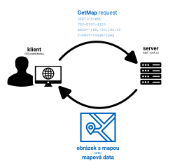
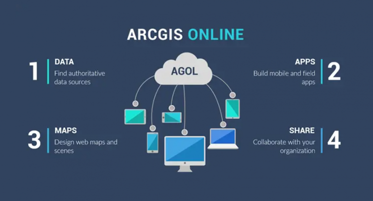

# Souřadnicové referenční systémy v ČR | přehled typů dat a zdrojů, webové mapové služby | připojení externích dat

## Mapové služby

Mapové služby jsou __webové nástroje poskytující geoprostorová data__ ze serveru na klienta __prostřednictvím internetu__. Klientem je (zjednodušeně) zařízení uživatele (např. webový prohlížeč) vysílající požadavek pro získání dat ze serveru. V praxi se většinou __klient služby dotazuje pomocí GIS aplikace__ (webové či desktopové), která na pozadí posílá serveru požadavky a následně zobrazuje přijatá data (viz obrázek). Díky vazbě dat na souřadnicový systém lze takto __kombinovat data s různými rozsahy a z různých zdrojů v jednom mapovém okně__ a data se zobrazí polohově správně.

{ .no-filter width=700px}
{align=center}

Pro mapové služby existují různé __standardy komunikace__:

- [OGC]("Open Geospatial Consortium") standardizované otevřené formáty: 
    - __WMS (Web Map Service)__: umožňuje sdílení geografické informace ve formě rastrových dat v prostředí Internetu
    - __WFS (Web Feature Service)__: umožňuje sdílení geografické informace ve formě vektorových dat v prostředí Internetu

- proprietární standard společnosti [Esri]("ESRI (Environmental Systems Research Institute) je společnost zabývající se vývojem softwaru určeného pro práci s geografickými informačními systémy"):
    - __ArcGIS REST__

???+ note-fg-color "Kde hledat mapové služby?"
    - geoportály (např. metadatový katalog [Národního geoportálu INSPIRE](https://geoportal.gov.cz/web/guest/home/){.color_def .underlined_dotted .external_link_icon target="_blank"})
    - webové stránky poskytovale (např. [Evropská agentura pro životní prostředí (EEA)](https://land.copernicus.eu/en/products/corine-land-cover?tab=main){ .color_def .underlined_dotted .external_link_icon target="_blank"})
    

## Geoportály

Geoportály jsou webové platformy, které poskytují přístup k geografickým datům a službám. Slouží jako centrální bod pro vyhledávání, prohlížení a stahování prostorových informací, jako jsou mapy, letecké snímky, katastrální data nebo údaje o životním prostředí. Mohou představovat cenný zdroj dat pro analýzu a plánování projektů. Lze zde například využít data o reliéfu terénu, dopravní infrastruktuře nebo vlastnických vztazích k pozemkům. Geoportály často nabízejí i nástroje pro prostorovou analýzu a vizualizaci dat, což může pomoci lépe porozumět kontextu projektů. Geoportály v širším slova smyslu představují také důležitý nástroj v územním plánování a správě měst. Umožňují veřejnosti i odborníkům přístup k aktuálním a relevantním informacím o daném území. Uživatelé mohou využít geoportály k získání podkladů pro své projekty, ale také k prezentaci svých návrhů veřejnosti. Díky geoportálům se stává územní plánování transparentnější a efektivnější, což přispívá k lepšímu rozvoji měst a regionů.

__Tipy na některé zajímavé geoportály:__

[Geoportál ČÚZK](https://geoportal.cuzk.cz/ "Český úřad zeměměřický a katastrální"){ .md-button .md-button--primary .button_smaller .external_link_icon target="_blank"}
[Geoportál AOPK](https://gis-aopkcr.opendata.arcgis.com/ "Agentura přírody a krajiny"){ .md-button .md-button--primary .button_smaller .external_link_icon target="_blank"}
[Geoportál ČSÚ](https://geodata.statistika.cz/portal/apps/sites/#/homepage "Český statistický úřad"){ .md-button .md-button--primary .button_smaller .external_link_icon target="_blank"}
[Geoportál Praha](https://geoportalpraha.cz/ "IPR Praha"){ .md-button .md-button--primary .button_smaller .external_link_icon target="_blank"}
[Geoportál města Brna](https://data.brno.cz/ "Magistrát města Brna"){ .md-button .md-button--primary .button_smaller .external_link_icon target="_blank"}
{.button_array}

## ArcGIS Online

[__ArcGIS Online__](https://www.arcgis.com/){.color_def .underlined_dotted .external_link_icon target="_blank"} je cloudová platforma pro geografické informační systémy od společnosti Esri. Umožňuje uživatelům vytvářet, sdílet a analyzovat mapy a geografická data prostřednictvím webového prohlížeče. **ArcGIS Online** představuje cenný nástroj pro vizualizaci a analýzu prostorových dat, jako mohou být urbanistické plány, dopravní sítě, demografické údaje nebo informace o životním prostředí. Platforma nabízí širokou škálu nástrojů pro tvorbu interaktivních map, 3D modelů a webových aplikací, které mohou být využity při plánování a prezentaci projektů. 

<figure markdown>
  { .no-filter width=700px}
  <figcaption>Zdroj: GIS Geography</figcaption>
</figure>

Díky **ArcGIS Online** mohou uživatelé snadno integrovat různé zdroje dat, provádět prostorové analýzy a vytvářet vizuálně atraktivní prezentace svých návrhů. Platforma také podporuje spolupráci a sdílení dat mezi uživateli, což umožňuje studentům a pedagogům efektivněji pracovat na společných projektech. ArcGIS Online je tak vhodným nástrojem pro moderní geografické vzdělávání, který studentům umožňuje rozvíjet dovednosti v oblasti prostorové analýzy a vizualizace.

<!--

# Práce s externími daty (Excel, CSV), join

Na rozdíl od předchozích úloh, kdy byla práce zaměřena na práci s poskytnutými prostorovými daty uloženými v geodatabázi či formátu SHP, se následující úloha soustředí na možnosti importu externích tabelárních dat a jejich připojení na prostorová data.

Prostřednictvím společného pole (klíče) lze přiřadit záznamy v jedné tabulce se záznamy v jiné tabulce (vrstvě). K vrstvě parcel můžete například přidružit tabulku informací o vlastnictví parcel, protože sdílejí pole identifikace parcely. Tato přidružení můžete vytvořit několika způsoby, včetně dočasného spojení či vytvoření trvalejších tříd vztahů uvnitř geodatabáze. Spojení může být také založeno na prostorovém umístění, jak bude demonstrováno v dalším cvičení č. 4.

## Základní pojmy

[:material-open-in-new: pro.arcgis.com Join the attributes from a table](https://pro.arcgis.com/en/pro-app/latest/help/data/tables/joins-and-relates.htm#GUID-39C9610A-6A73-4985-ADB8-7354EA9DB8BF){ .md-button .md-button--primary .url-name target="_blank"}
[:material-open-in-new: pro.arcgis.com Join data by location (spatially)](https://pro.arcgis.com/en/pro-app/latest/help/data/tables/joins-and-relates.htm#GUID-7B11EAA4-35E0-4B8D-AFB6-4A435761574B){ .md-button .md-button--primary .url-name target="_blank"}
[:material-open-in-new: pro.arcgis.com Remove join](https://pro.arcgis.com/en/pro-app/latest/help/data/tables/joins-and-relates.htm#ESRI_SECTION1_6507320BCB1E45219A88F1AA0A24F7B9){ .md-button .md-button--primary .url-name target="_blank"}
{: align=center style="display:flex; justify-content:center; align-items:center; column-gap:20px; row-gap:10px; flex-wrap:wrap;"}
-->

