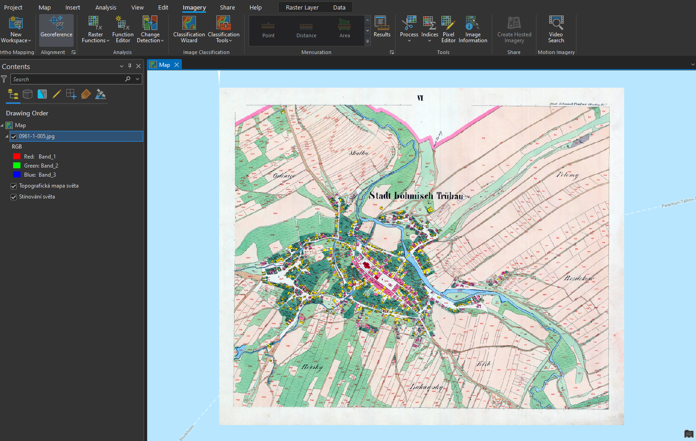
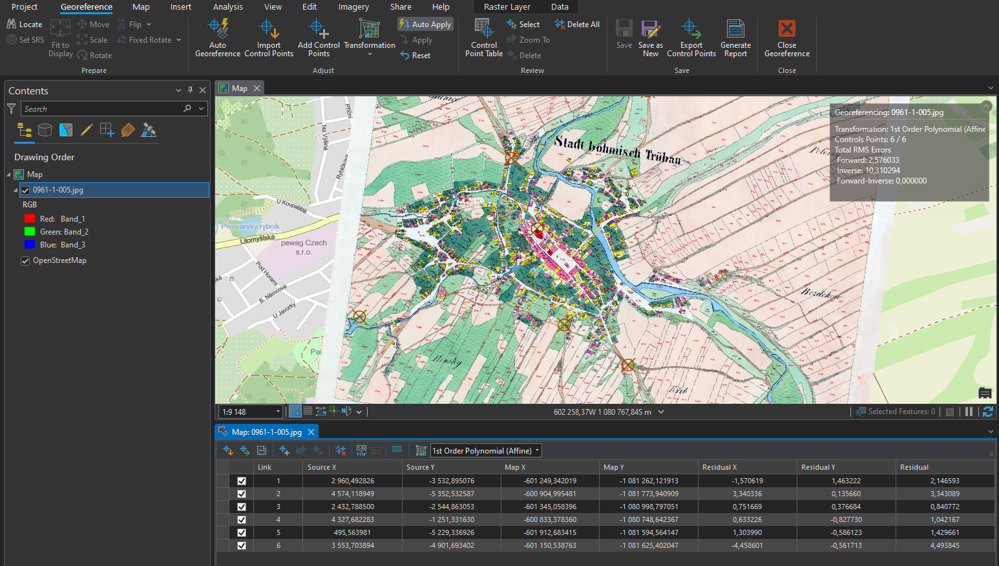

# Rastrová data, georeferencování

## Cíl cvičení

Seznámení se s rastrovými daty v GIS a ukázka využití těchto dat. Souřadnicové připojení rastrových dat.

## Základní pojmy

- **rastr** – datová struktura založená na buňkách uspořádaných do řádek a sloupců, kde hodnota každé buňky reprezentuje hodnotu jevu
- [**rastrová data**](https://pro.arcgis.com/en/pro-app/latest/help/data/imagery/introduction-to-raster-data.htm) – prostorová data vyjádřená formou matice buněk nebo pixelů; spojitá data (nejčastěji digitální modely terénu, digitalizované mapy)
- [**pixel (buňka)**](https://pro.arcgis.com/en/pro-app/latest/help/data/imagery/pixel-size-of-image-and-raster-data-pro-.htm) – základní geometrický prvek zpravidla čtvercového tvaru; jeho množina vytváří rastrový digitální obraz; 1 buňka = 1 hodnota
- [**prostorové rozlišení rastru**](https://pro.arcgis.com/en/pro-app/latest/tool-reference/environment-settings/cell-size.htm) – velikost 1 buňky (pixelu) rastru (cell size)
- [**resample**](https://pro.arcgis.com/en/pro-app/latest/tool-reference/data-management/resample.htm) – změna prostorového rozlišení rastru
- [**transformace**](https://pro.arcgis.com/en/pro-app/latest/help/mapping/properties/geographic-coordinate-system-transformation.htm) – obecný pojem pro výpočet, jehož cílem je převod souřadnic bodů z jednoho souřadnicového systému do druhého
- [**georeference**](https://pro.arcgis.com/en/pro-app/3.0/help/data/imagery/overview-of-georeferencing.htm) – souřadnicové určení snímku
- [**pyramidování rastru**](https://pro.arcgis.com/en/pro-app/latest/help/data/imagery/raster-pyramids.htm) – ukládání dat do menšího rozlišení pro rychlejší práci; pyramidy (náhledy) jsou uloženy v souborech *.ovr*

## Použité datové podklady

- [ArcČR 500](../../data/#arccr-500)
- [Císařské otisky stabilního katastru](../../data/#cisarske-otisky-stabilniho-katastru)

## Náplň cvičení

### Ukázka nejčastějších rastrových typů dat

-   :material-elevation-rise:{ .lg .middle height} __Digitální model terénu/reliéfu__

    ---

    

-   :material-grid:{ .lg .middle } __Stínovaný reliéf__

    ---

    

-   :material-map:{ .lg .middle } __Naskenovaný mapový list__

    ---
    

-   :material-airplane:{ .lg .middle } __Ortofoto__

    ---
    

-   :fontawesome-solid-satellite:{ .lg .middle } __Družicová data__

    ---
    

### Georeferencování rastru

**Zdroj dat** – ČÚZK

**Návod ke georeferencování:**

**1.** Načtení rastru do mapového okna z adresáře v záložce _:material-tab: Catalog_{: .outlined_code} . Rastr se umístí po počátku aktuálního souřadnicového systému. Přiblížit se na něj lze po kliknutí pravým tlačítkem na jeho název v záložce _:material-tab: Contents_{: .outlined_code}  → _:material-form-dropdown: Zoom To Layer_{: .outlined_code} .

**2.** Následně zapneme funkci Georeference: záložka _:material-tab: Imagery_{: .outlined_code}  → _:material-button-cursor: Georeference_{: .outlined_code} .

<figure markdown>
  
  <figcaption>Georeferencování rastru</figcaption>
</figure>

**3.** V nástroji _:material-button-cursor: Georeference_{: .outlined_code} je potřeba nastavit identické body, na základě kterých se mapový list transformuje do souřadnicového systému mapy.

**4.** Mapu přiblížíme na výřez obrazovky tlačítkem _:material-button-cursor: Fit to Display_{: .outlined_code} .

**5.** Pokud již známe identické body, je možné je importovat pomocí _:material-button-cursor: Import Control Points_{: .outlined_code}. Jestliže tyto body nemáme, musíme je ručně vytvořit tlačítkem _:material-button-cursor: Add Control Points_{: .outlined_code} .

**6.** Při vkládání bodů se nejprve určí bod ze vstupního mapového listu (_:material-button-cursor: source_{: .outlined_code}) a následně jeho ekvivalent v mapě (_:material-button-cursor: target_{: .outlined_code}). Důležité je vybírat identické body rovnoměrně po celé ploše mapového listu a ideálně vybírat taková místa, která jsou na obou vrstvách (mapový list a podkladová mapa) totožná. Nejčastěji se jedná o rohy významných budov (kostely), křížení silnic či boží muka. Identické body a jejich přesnost určujeme dle měřítka georeferencované mapy.

**7.** V některých případech je velmi obtížné najít identické body, zejména u starších archiválií. Na příkladu, který je uveden v tomto návodu, je patrná obrovská změna využití ploch v České Třebové.

<figure markdown>
  
  <figcaption>Georeferencovaný mapový list</figcaption>
</figure>

???+ note "&nbsp;Zadávání souřadnic identických bodů:"
      Pokud známe souřadnice identického bodu, lze je zapsat ručně: klikneme na bod v připojované mapě → pravým kliknutím myši následně otevřeme nabídku, ve které se zadají souřadnice identického bodu v cílové mapě. Tuto metodu lze využít při georeferencování na geodeticky zaměřené body nebo na rohy mapového listů o známých souřadnicích (např. Topografické mapy v systému S–52).

**8.** Během procesu georeferencování je nutné sledovat přesnost výsledného souřadnicového umístění dat. Tu na jdeme v tabulce _:material-tab: Control Point Table_{: .outlined_code}  v nástroji _:material-tab: Georeference_{: .outlined_code} . V této tabulce se nachází přehled všech identických bodů včetně jejich souřadnicových přesností. Můžeme zde také body mazat nebo je vyřadit z výpočtu transformace. Body jsou zároveň znázorněny v mapovém okně.

**9.** Při georeferencování v *ArcGIS Pro* lze použít několik druhů souřadnicových transformací. Druh transforamce volíme na základě vstupních dat. Pro ukázku s císařskými otisky stabilního katastru, je ideální afinní transformace, která se nabízí jako výchozí.

**10.** Pokud jsme spokojeni s georeferencováním, uložíme jej tlačítkem _:material-button-cursor: Save_{: .outlined_code} . Jestliže by bylo potřeba, je možné nastavení souřadnicového umístění změnit. Nástroj Georeference můžeme nyní zavřít _:material-button-cursor: Close_{: .outlined_code} .

???+ note "&nbsp;Georeferencování vytvoří pro každý rastr dva další soubory s parametry:"
      - JGWX – transformační klíč

      - XML – informace o souřadnicovém systému a parametrech georeference

## Úlohy k procvičení

!!! task-fg-color "Úlohy"

    K řešení následujích úloh použijte datovou sadu [ArcČR
    500](../../data/#arccr-500) verzi 3.3 dostupnou na disku *S* ve složče
    ``K155\Public\data\GIS\ArcCR500 3.3``. Zde také najdete souboru s
    popisem dat ve formátu PDF. Další datové vrstvy, která budete
    potřebovat pro vyřešení následujících úloh, jsou dostupné ke stažení
    jako [zip archiv](https://geo.fsv.cvut.cz/vyuka/155gis1/geodata/gis1-cviceni05.zip).

    1. Vizuálně zjistěte jaká je nejvíce zastoupená "barva" podloží v okrese Pelhřimov.

    2. Vizuálně zjistěte na jakém mapovém listu ZM25 leží Mšené Žehrovice.

    3. Vytvořte výsledný rastr, který bude v souřadnicovém systému UTM-33N
       (velikost pixelu 300m). Vrstvu vyexportujte do formátu GeoTIFF.
