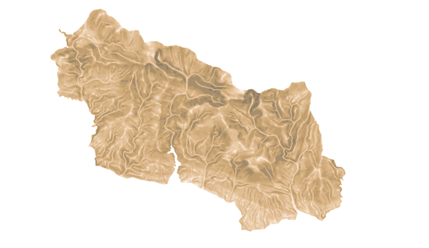
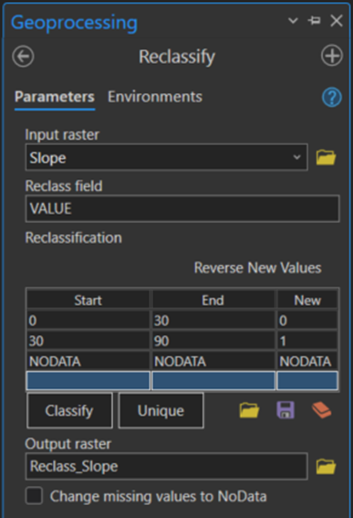
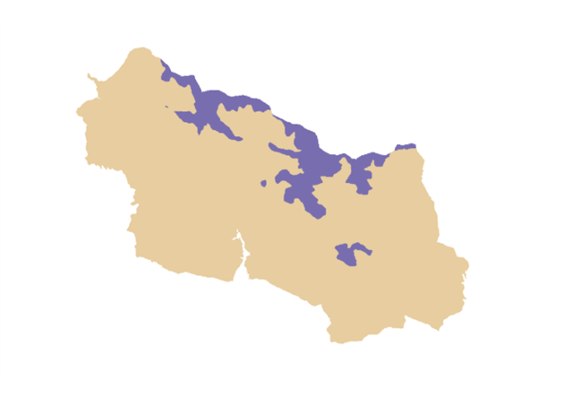

# Topografická analýza povrchu, reklasifikace rastrových dat

Ve cvičení se naučíte
{: align=center style="font-size: 1.25rem; font-weight: bold; margin-bottom: 10px;"}

-   :material-terrain:{ .xxxl .middle }
    {.middle style="display:table-cell;min-width:40px;padding-right:.8rem;"}

    základy analýzy povrchu s využitím __topografických funkcí__
    {.middle style="display:table-cell;line-height:normal;"}

-   :material-grid:{ .xxxl .middle }
    {.middle style="display:table-cell;min-width:40px;padding-right:.8rem;"}
    
    __reklasifikovat__ rastrová data
    {.middle style="display:table-cell;line-height:normal;"}

## Základní pojmy

- [**slope**](https://pro.arcgis.com/en/pro-app/latest/tool-reference/3d-analyst/slope.htm)
- [**aspect**](https://pro.arcgis.com/en/pro-app/latest/tool-reference/3d-analyst/aspect.htm)
- [**hillshade**](https://pro.arcgis.com/en/pro-app/latest/tool-reference/3d-analyst/hillshade.htm)
- [**viewshed**](https://pro.arcgis.com/en/pro-app/latest/tool-reference/spatial-analyst/viewshed.htm)
- [**visibility**](https://pro.arcgis.com/en/pro-app/latest/tool-reference/spatial-analyst/visibility.htm)
- [**raster surface toolset**](https://pro.arcgis.com/en/pro-app/latest/tool-reference/3d-analyst/an-overview-of-the-raster-surface-toolset.htm)
- [**aspect-slope**](https://pro.arcgis.com/en/pro-app/latest/help/analysis/raster-functions/aspect-slope-function.htm)

## Náplň cvičení
Vaším úkolem bude na základě rastrových dat vybraného území analyzovat lavinové svahy mají. K vyhodnocení lavinového svahu potřebujete znát sklonitost a expozici svahu, nadmořskou výšku či krajinný pokryv. Podmínky pro vznik lavin lze (zjednodušeně) shrnout v následujících bodech:

1. Nadmořská výška
Laviny se zpravidla vyskytují ve vyšších nadmořských výškách. Jako území vhodné pro vznik lavin volte lokality, které se nachází v nejvyšší třetině všech nadmořských výšek v rámci zájmového území.

2. Sklon svahu
Základní předpoklad pro uvolnění laviny je sklon svahu, s jehož růstem se zvyšuje pravděpodobnost a riziko vzniku lavin. Laviny suchého sněhu vzácně vznikají na svazích již od 25° sklonu a se vzrůstajícím sklonem jejich četnost narůstá, zejména ve svazích nad 30° sklonu. Pro účely práce tedy zvolte mezní hodnotu v tomto intervalu.

3. Expozice svahu
Uprostřed zimy bývají kritické zejména stinné svahy v severní expozici. Uvažujme tedy svahy severovýchodní, severní a severozápadní orientace.

4. Krajinný pokryv
Riziko vzniku lavin nastává na otevřených plochách bez většího vegetačního porostu. Hodnoty krajinného pokryvu jsou obsaženy ve sloupci *Code 18* (CLC 2018). Vyhovujícími hodnotami jsou 2.X.X a 3.X.X. (vyjma 3.1.1., 3.1.2 a 3.1.3.).

## Použité datové podklady
- DMR 5G
- CORINE Land Cover 2018

## Postup
Řešení popisuje postupné použití jednotlivých nástrojů geoprocessingu, vaším úkolem je těmto funkcím porozumět a úlohu zpracovat v *Model Builderu*.

**1.** Po založení nového projektu v ArcGIS a nastavení Křovákova zobrazení, importujte potřebná data: DMR Krkonošského parku a vrstva *Velkoplošná chráněná území* z ArcGIS Online (poskytuje AOPK ČR).

**2.** Na základě DMR je nejprve možné vyhodnotit nejvyšší třetinu zájmového území. Rozpětí výšek je možné zjistit ve vlastnostech rastru a stanovit mezní hodnotu nejvyšší třetiny. Pomocí nástroje *Reclassify* následně proběhne reklasifikace dat: hodnotám menším než mezní nastavíme novou hodnotu 0; hodnotám od mezní výše přiřadíme novou hodnotu 1.

**3.** Nyní pokročíme k rastrové analýze, která vždy zahrnuje použití jedné z topografických funkcí a následnou reklasifikaci. Těmito funkcemi budou postupně: *Slope* (podmínka č. 2) a *Aspect* (podmínka č. 3). Nastavení reklasifikace rastrových výstupů proběhne dle podmínek v zadání; vždy přiřaďte novou hodnotu 0 pro nevyhovující hodnoty (tzn. oblasti nesplňující kritéria lavinových svahů) a hodnotu 1 pro vyhovující.

Pro názornost následuje ukázka zpracování sklonitosti svahu (postup s výpočtem a reklasifikací expozice je analogický).

<figure markdown>
  { width="600"}
  <figcaption>Výstupní rastr po použití topografické funkce Slope (na vstupu DMR)</figcaption>
</figure>

<figure markdown>
  { width="300"}
  <figcaption>Parametry reklasifikace rastru sklonitosti terénu</figcaption>
</figure>

<figure markdown>
  { width="600"}
  <figcaption>Reklasifikovaný rastr sklonitosti terénu indikující hodnoty nad a pod mezní hodnotou</figcaption>
</figure>

**4.** Jakmile proběhne analýza DMR, přistoupíme ke zpracování CLC 2018. Jedná se o další reklasifikaci, která byla provedena již v předchozích fázích, avšak na vstupu je CLC 2018 a pravidla pro nastavení reklasifikace jsou obsáhlejší (viz zadání).

???+ note "&nbsp;Pozn."
      V současné podobě nabízí produkt CORINE Land Cover (CLC) celoevropská data půdního pokryvu a využití půdy se 44 tematickými třídami, od rozsáhlých lesních ploch až po jednotlivé vinice. Produkt je každých šest let aktualizován o nové vrstvy stavu a změn - poslední aktualizace byla provedena v roce 2018. CLC slouží mnoha uživatelům a má téměř neomezené potenciální i reálné využití, včetně monitorování životního prostředí, územního plánování, hodnocení klimatických změn a krizového řízení (land.copernicus.eu).

**5.** Na závěr přichází stěžejní část celé úlohy: vyhodnotit lavinové svahy. Nyní tedy využijeme dílčí výsledky (reklasifikované vrstvy obsahující pouze hodnoty 0 a 1). Cílem je zkombinovat podmínky a brát v potaz pouze taková místa, kde nastávají právě všechny čtyři. K tomuto účelu lze elegantně využít rastrovou kalkulačku *Raster Calculator* a sestavit správný algebraický výraz. Matice všech reklasifikovaných rastrů mezi sebou vynásobíme, čímž získáme nový rastr obsahující hodnoty 1 v místech, kde je splněna každá podmínka zadání, a hodnoty 0, kde není splněna žádná podmínka či pouze jedna, dvě nebo tři libovolné (aby byl výsledek roven 0, postačí jediná 0 mezi činiteli). Výstupní rastr tedy indikuje oblasti lavinového nebezpečí dle zadaných podmínek. Nakonec je vhodné nastavit vhodnou barvu pro jednotlivé hodnoty buněk.

**6.** Alternativní přístup by mohl být reprezentován symbolizací různých úrovní lavinového rizika, kterých lze dosáhnout změnou výrazu v rastrové kalkulačce. Místo násobení hodnot čtyř rastrových vrstev je můžete jednoduše sečíst. Výstup bude tvořit 5 různých hodnot: 0, 1, 2, 3 nebo 4. Následně změňte symbologii rastru tak, abyste podle těchto hodnot označili rostoucí lavinové riziko.

## Úlohy k procvičení

!!! task-fg-color "Úlohy"

    K řešení následujích úloh použijte datovou sadu [ArcČR
    500](../../data/#arccr-500) verzi 3.3 dostupnou na disku *S* ve složče
    ``K155\Public\data\GIS\ArcCR500 3.3``. Zde také najdete souboru s
    popisem dat ve formátu PDF.

    1. Vytvořte DMT omezené na Ústecký kraj. Jaká je výměra území v ha s nadmořskou výškou větší než 700m?

    2. Jaká je výměra území v ha se sklonem svahu větším než 15 stupňů?

    3. Jaká je výměra území v ha s orientací svahu na sever a zároveň se sklonem větším než 15 stupňů?

    4. Jaká je výměra území v ha s orientací svahu na sever anebo se sklonem větším než 15 stupňů?

    5. Jaká je výměra území v ha, které je viditelné z vrcholu Milešovky
       [S-JTSK: 986668, 770118] a zároveň má orientaci svahu na sever?

    6. Jaká je výměra území v ha, kde jsou splněny alespoň 2 z
       následujících podmínek - nadmořská výška nad 700 m, sklon větší než
       15 stupňů, orientace na sever?

    7. Jaká je výměra území v ha, které je do 500 m od nejbližší silnice a
       zároveň má sklon větší než 15 stupňů?

    8. Jak dlouhý úsek silnice E55 v km je vidět z vrcholu Milešovky [S-JTSK: 986668, 770118]?

    9. Jaká ve výměra území v ha, kde nadmořská výška je menší než výraz "10 krát sklon svahu ve stupních"?

    10. Jaká je nadmořská výška vrcholu Milešovky [S-JTSK: 986668, 770118] odvozená z DMT (správně je 836,5 m)?

    11. Jaký je rozdíl celkové délky v metrech silnic 1.třídy měřeného po povrhu a jeho průmětu do roviny?

    12. Jaká je skutečná délka (v km, na jedno des. místo) silnice číslo
        '112' po povrchu DMT? Uveďte minimální a maximální výšku u této
        komunikace?

