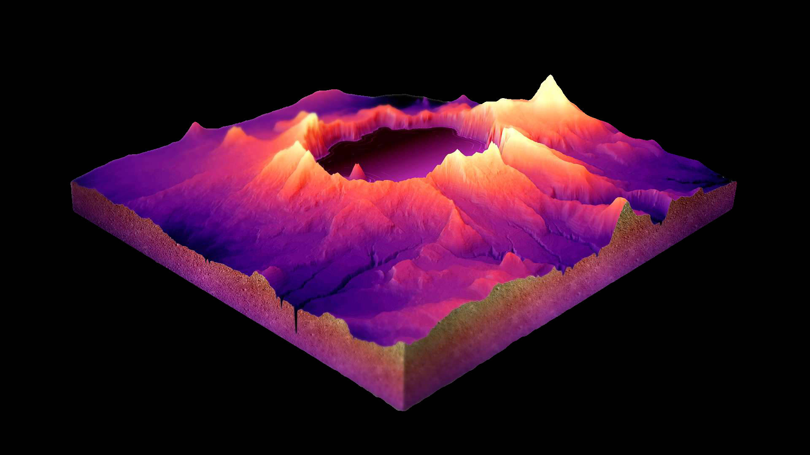
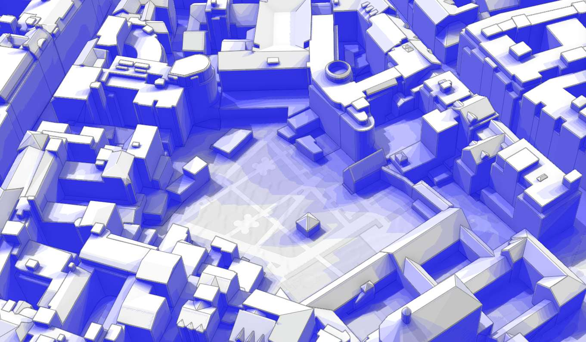
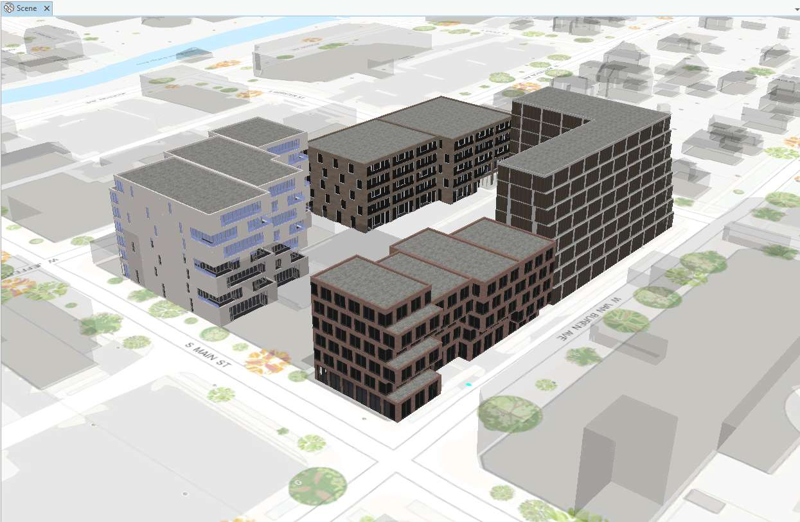

# 3D vizualizace v GIS

{: .no-filter }
{: .no-filter }
{: .no-filter }
{: .no-filter }
{: .no-filter }
{: .no-filter }
{: .no-filter }
{: .no-filter }

<!-- 
 -->

## Náplň cvičení
Úkolem je **vytvořit 3D scénu** (v ArcGIS Pro a ArcGIS Online) na podkladech dostupných GIS dat.  
**Scéna bude obsahovat**:

:material-terrain:{.lg .middle style="margin-right:.4em"} rastrový model terénu

:fontawesome-solid-house:{.lg .middle style="margin-right:.4em"} zjednodušené 3D modely budov (s výškami odvozenými z hodnot atributu)

:material-tree:{.lg .middle style="margin-right:.4em"} 3D modely vegetace (stromů, rozlišení min. dvou druhů)

:fontawesome-solid-building-columns:{.lg .middle style="margin-right:.4em"} 3D model významného objektu (rozhledny)

{: .no-filter width="600em"}
{align=center}

## Pracovní postup

**Model terénu**

- výřez rastru z webové služby [Geoportálu ČÚZK](https://geoportal.cuzk.cz/(S(grqmhsoejjqzgx4ofarvzeq0))/Default.aspx?mode=TextMeta&text=uvod_uvod&head_tab=sekce-00-gp&menu=01&news=yes "→ Služby → Prohlížecí → Služby Esri ArcGIS Server → IMAGE služba AGS - Digitální model reliéfu České republiky 5. generace (DMR 5G)"){.underlined_dotted} – nástroj **:material-briefcase: Clip Raster**{.no-dec .outlined} nebo **:material-briefcase: Copy Raster**{.no-dec .outlined}

{.process_container}

- nastavení rastru jako "*Ground*" v lokální scéně ArcGIS Pro

{.process_container}

**Zjednodušené modely budov**

- extrakce prvků z webové služby [Geoportálu ČÚZK](https://geoportal.cuzk.cz/(S(grqmhsoejjqzgx4ofarvzeq0))/Default.aspx?mode=TextMeta&text=uvod_uvod&head_tab=sekce-00-gp&menu=01&news=yes "→ Služby → Prohlížecí → Služby Esri ArcGIS Server → Mapová služba nad daty RÚIAN → podvrstva StavebniObjekt (3)"){.underlined_dotted} – nástroj **:material-briefcase: Select**{.no-dec .outlined} (s nastaveným výběrem či rozsahem zobrazení)

{width=300}
{align=center}

- funkce extrusion (max height), expression: `Ceil(Random()*10+15)` nebo `pocet_podlazi*4` – vytáhne polygon podél osy Z o náhodný počet metrů v rozmezí 16 až 25 metrů nebo o počet podlaží ×4 metry

{width=300}
{align=center}

- volitelně přidat atribut "barva" s náhodnými hodnotami od 1 do 4 (barva fasády)
- konverze geometrie z Polygon do Multipatch – nástroj **:material-briefcase: Layer 3D to Feature Class**{.no-dec .outlined} (nástroj zapíše do databáze extrudované polygony jako 3D geometrii)

{.process_container}

**Vegetace**

- získání ploch s vegetací ve formě polygonů (extrakce prvků z webové vrstvy ZABAGED či ručním kreslením)

{width=300}
{align=center}

- rozmístění bodů s náhodnou polohou v ploše polygonů – nástroj `Create Spatial Sampling Locations`

{.process_container}

- přidání číselného atributu "druh" rozlišujícího dva druhy stromu, které budou v 3D scéně rozlišeny odlišnými 3D modely
- vyplnění atributu "druh" náhodnými hodnotami 1 a 2 – nástroj `Calculate Field`, expression: `Ceil(Random()*2)`
- *volitelně: přidání číselného atributu "rotace" a jeho vyplnění náhodnými hodnotami azimutu (0 až 360°), tento atribut bude reprezentovat otočení modelu stromu, čímž scéně dodá na realističnosti

{.process_container}

- nastavení 3D bodové symboliky

{.process_container}

- ~~konverze geometrie z Point do Multipatch – nástroj **:material-briefcase: Layer 3D to Feature Class**{.no-dec .outlined} (nástroj zapíše do databáze bodovou 3D symboliku jako 3D geometrii)~~

**3D model významného objektu**

- získání souboru s modelem (formáty .DAE, .DWG, .FBX, .GLB, .GLTF, .IFC, .OBJ, .USDC, .USDZ, event. .IFC), příkladový model (Petřínská rozhledna) zde: [:material-cube-outline: OBJ](../assets/cviceni8/petrinska_rozhledna.obj){.md-button .md-button--primary .button_smaller}, [:material-cube-outline: MTL](../assets/cviceni8/petrinska_rozhledna.mtl){.md-button .md-button--primary .button_smaller}
- import modelu do geodatabáze – nástroj `Import 3D Files` ~~nebo `Import 3D Objects`~~ (nastavit souřadnicový systém na S-JTSK 5514, ~~pozor na orientaci modelu – "Y is up"~~)
- ~~posun modelu na správné souřadnice – editační nástroj `Move to`~~

{width=300}
{align=center}

---

**Export do webové scény**

- Budovy a rozhledna: konverze do formátu SLPK (balíček optimalizovaný pro zobrazení na webu) – nástroj `Create 3D Object Scene Layer Content` (nastavit souřadnicový systém na Web Mercator 3857 a správnou transformaci)

{.process_container}

- Stromy: je možné aplikovat stjený postup (konverze do formátu SLPK, 3D symbolika zvolená v ArcGIS Pro bude pevně zapsána jako 3D geometrie) NEBO je možné data publikovat jako bodovou vrstvu (bez konverze, symboliku bude možné zvolit ve webové scéně jako 3D bodový symbol)

- publikace do ArcGIS Online

{.process_container}

- konfigurace a sdílení scény

**Datové zdroje**

[geoportal.cuzk.cz DMR 5G](https://geoportal.cuzk.cz/(S(grqmhsoejjqzgx4ofarvzeq0))/Default.aspx?mode=TextMeta&side=wms.AGS&text=WMS.AGS&head_tab=sekce-03-gp&menu=314){ .md-button .md-button--primary .server_name .external_link_icon_small target="_blank"}
[geoportal.cuzk.cz RÚIAN](https://geoportal.cuzk.cz/(S(grqmhsoejjqzgx4ofarvzeq0))/Default.aspx?mode=TextMeta&side=wms.AGS&text=WMS.AGS&head_tab=sekce-03-gp&menu=314){ .md-button .md-button--primary .server_name .external_link_icon_small target="_blank"}
[geoportal.cuzk.cz ZABAGED](https://geoportal.cuzk.cz/(S(grqmhsoejjqzgx4ofarvzeq0))/Default.aspx?mode=TextMeta&side=wms.AGS&text=WMS.AGS&head_tab=sekce-03-gp&menu=314){ .md-button .md-button--primary .server_name .external_link_icon_small target="_blank"}
[&nbsp; 3D model význ. objektu](../assets/cviceni8/petrinska_rozhledna.obj){ .md-button .md-button--primary .server_name .external_link_icon_small target="_blank"}
{.button_array}

---

**Schéma pracovního postupu**

