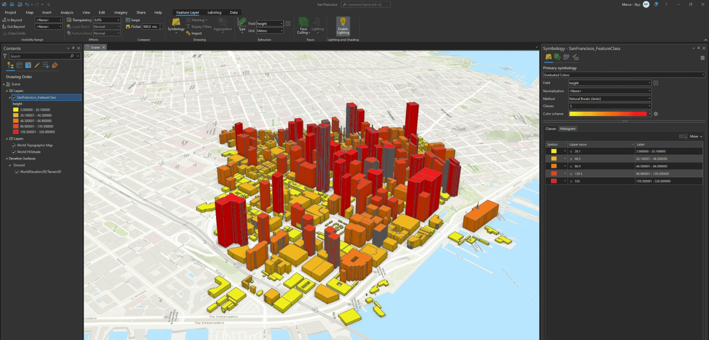
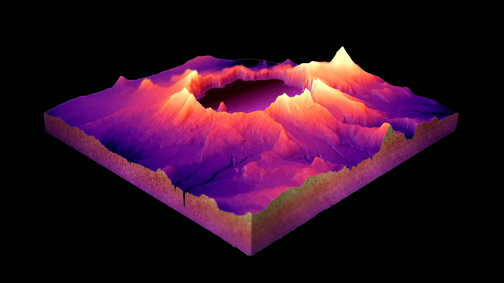
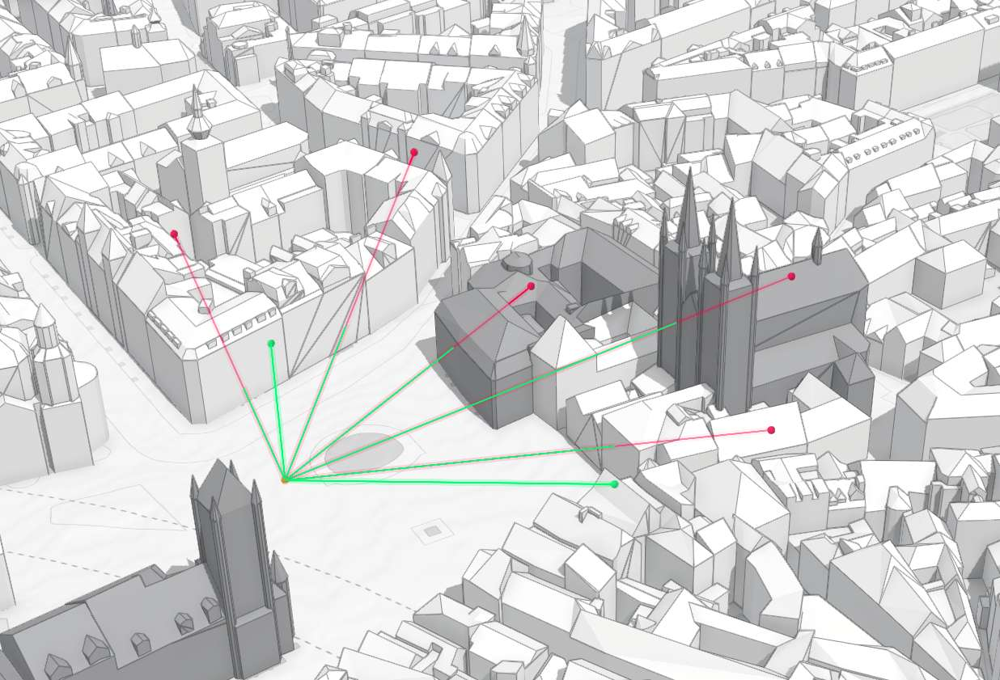
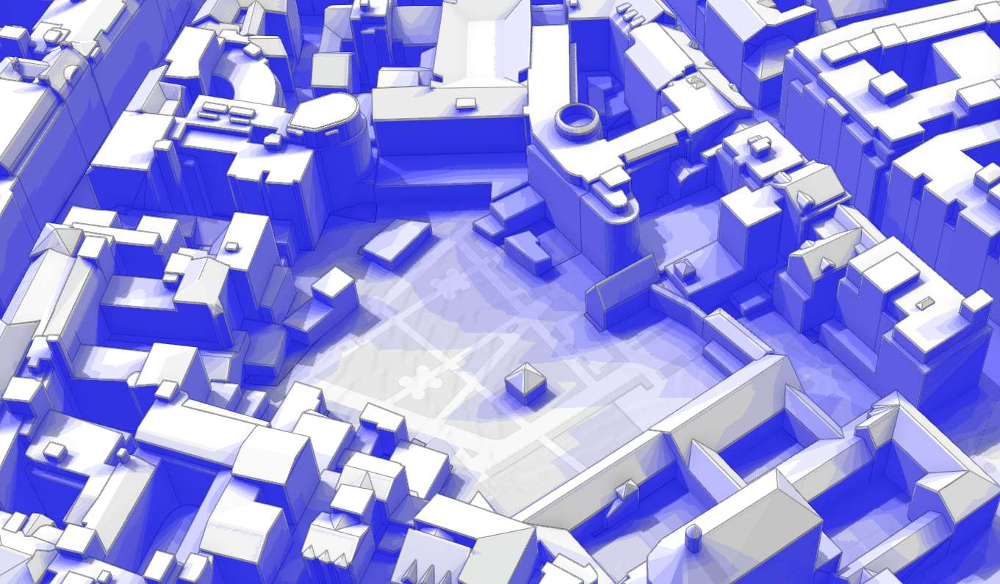
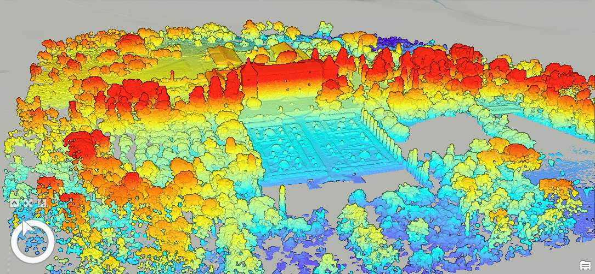
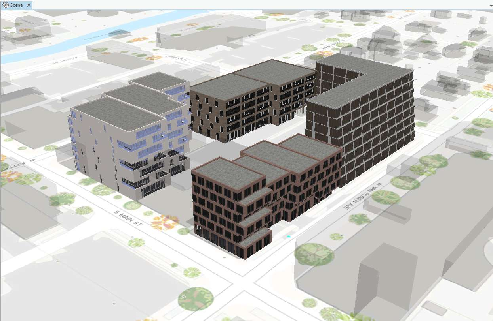
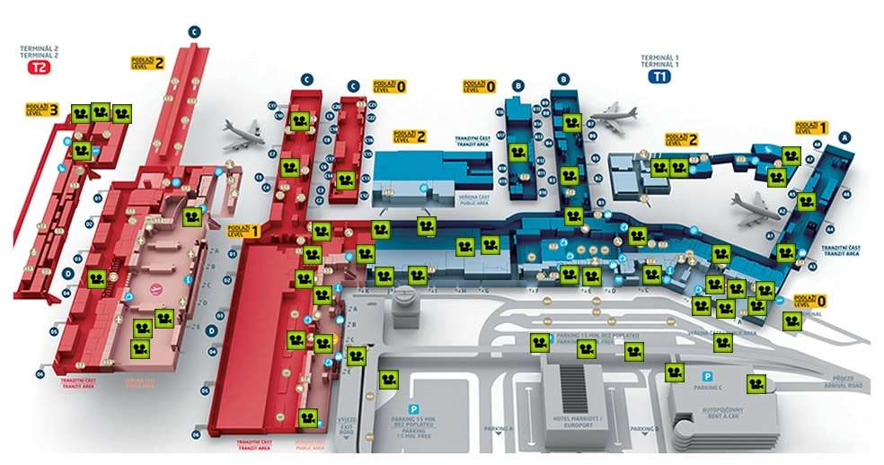
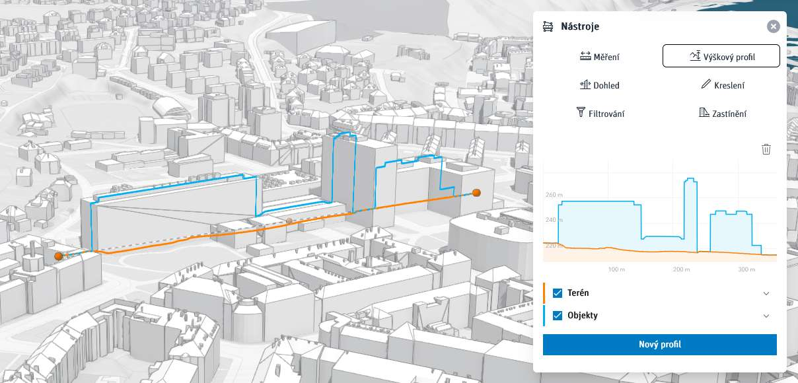
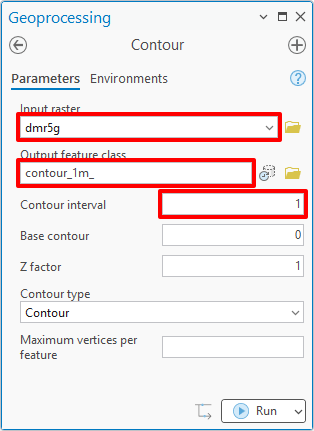
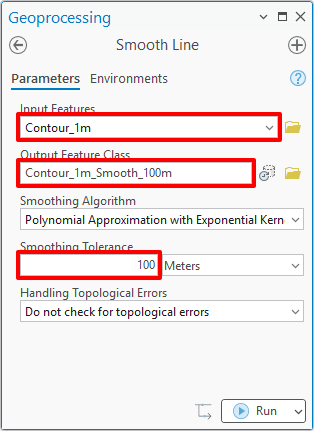

# Export 3D dat do CAD

{: .no-filter }
{: .no-filter }
{: .no-filter }
{: .no-filter }
{: .no-filter }
{: .no-filter }
{: .no-filter }
{: .no-filter }

<!-- 
 -->

## Náplň cvičení
GIS je mocným nástrojem pro analýzy a správu geoprostorových dat. Není ale náhradou CAD systémů, a proto je někdy nutné **data přenést z GIS do CAD**.

**Exportovat budeme**:

:material-terrain:{.lg .middle style="margin-right:.4em"} vektorový model terénu (trojúhelníková síť)

:material-selection-ellipse-remove:{.lg .middle style="margin-right:.4em"} vrstevnice (vyhlazené)

:fontawesome-solid-house:{.lg .middle style="margin-right:.4em"} 3D modely budov a vegetace

:material-vector-point-edit:{.lg .middle style="margin-right:.4em"} zpracování lidarových dat (mračen bodů laserového skenování)

## Pracovní postup

### Konverze digitálního modelu terénu z ratru do CAD (TIN)

Rastrová výšková data jsou běžným formátem v **GIS**. Ve světě **CAD** se ale pracuje výhradně ve vektoru. Před exportem je proto nutné provést **konverzi z :material-view-grid-outline: rastru do :material-vector-square: vektoru**.

Konverzi je nutné provést přes tzv. **TIN** (**triangulated irregular network** = nepravidelná trojúhelnková síť). Jedná se o speciální datový formát, nejde uložit do geodatabáze a v tomto postupu **se jedná pouze o meziprodukt**.

Nástroj pro převod se jmenuje [**:material-briefcase: Raster to TIN**{.outlined_code}](https://pro.arcgis.com/en/pro-app/latest/tool-reference/3d-analyst/raster-to-tin.htm). Parametr `Z Tolerance` je **nutné vyzkoušet** tak, aby výsledek svou podrobností odpovídal svému finálnímu účelu (**větší podrobnost není vždy lepší**, narůstá pak počet polygonů a tedy i objem dat).

TIN se automaticky zobrazí s výchozí symbolikou, pro **zobrazení jednotlivých trojúhelníků** je nutné v panelu symboliky **přepnout zobrazení hran** (viz obrázek).

{: .off-glb .process_icon}

{: .off-glb .process_icon}

{.process_container}

{width="30%"}
{width="30%"}
{align=center}

#### Převod do Polygonové třídy prvků

Protože neexistuje nástroj pro přímou konverzi z formátu TIN do CAD, je nutné TIN **převést na běžnou polygonovou třídu prvků** (Feature Class). Nástroj se jmenuje [**:material-briefcase: TIN Triangle**{.outlined_code}](https://pro.arcgis.com/en/pro-app/latest/tool-reference/3d-analyst/tin-triangle.htm).

{.process_container}

#### Převod do Multipatch třídy prvků (kvůli plochování)

V této fázi jsou trojúhelníky v podobě polygonů – ty se ale v CADu zobrazí jako uzavřené linie – ne jako plochy. Proto je ještě nutné provést **konverzi do Multipatch geometrie** – nástrojem [**:material-briefcase: Layer 3D To Feature Class**{.outlined_code}](https://pro.arcgis.com/en/pro-app/latest/tool-reference/3d-analyst/layer-3d-to-feature-class.htm). Nástroj vyžaduje jako vstup vrstvu přidanou v mapě.

{.process_container}

#### Sloučení objektů (volitelné)

Při exportu do CADu v této podobě by bylo vše v pořádku, ale **každý trojúhelník by byl samostatným objektem**, což nemusí každému vyhovovat (velké množství objektů by také mohlo způsobit problémy s výkonem – pomalé prohlížení, zasekávání apod.). Lze to řešit **spojením trojúhelníků to jednoho objektu** (lze pouze u Multipatch geometrie) editačním nástrojem [**:material-vector-polyline-edit: Merge**{.outlined_code}](https://pro.arcgis.com/en/pro-app/latest/help/editing/merge-features-into-one-feature.htm) – **nejedná se o geoprocessingový nástroj Merge, ale o nástroj editační** (viz obrázek).

__pozor__{style="color:#c22521;" .icon-exclm} – **při větším počtu spojovaných prvků je nástroj velmi pomalý**, pro 10 000 prvků proces trvá přibližně minutu, pro větší počty pak více (s nejasnou úměrností). Během cvičení je doporučeno tento krok vynechat nebo použít pro malé území. V praxi pak lze pracovat např. tak, že se nástroj pustí přes noc.

{: .off-glb .process_icon}

{.process_container}

#### Export do DWG/DXF

ArcGIS Pro obsahuje nástroj [**:material-briefcase: Export to CAD**{.outlined_code}](https://pro.arcgis.com/en/pro-app/latest/tool-reference/conversion/export-to-cad.htm), který umožňuje **konverzi jakéhokoliv typu vektorové geometrie do formátů DWG a DXF**. Opět **pozor na velikost a počet objektů**, které to funkce vstupují. Nástroj by mohl běžet velmi dlouho nebo vytvořit tak velký soubor, že by v CAD nešel otevřít.

---

### Konverze digitálního modelu terénu z ratru do CAD (vrstevnice)

Vrstevnice jsou v podstatě jedním z možných způsobů modelování terénu. V GISu je můžeme získat např. **konverzí z rastrového digitálního modelu terénu** – nástrojem [**:material-briefcase: Contour**{.outlined_code}](https://pro.arcgis.com/en/pro-app/latest/tool-reference/3d-analyst/contour.htm). Parametry nástroje jsou vcelku intuitivní, nicméně vytvořené vrstevnice většinou **nejsou vyhlazené**, a tedy nijak zvlášť estetické.

{.process_container}

#### Vyhlazení vrstevnic

Vyhlazení je možné řešit ve dvou krocích – jednak samotným **vyhlazením linií**, k čemuž slouží nástroj [**:material-briefcase: Smooth Line**{.outlined_code}](https://pro.arcgis.com/en/pro-app/latest/tool-reference/cartography/smooth-line.htm) (parametr `Smoothing Tolerance` je nutné vyzkoušet a postupně nalézt vhodnou hodnotu).

A jako druhý krok lze **odstranit** (nebo skrýt) **vrstevnice kratší než stanovená tolerance** (závisí na podrobnosti).

{: .off-glb .process_icon}

{.process_container}

#### Export do CAD

Export probíhá stejným způsobem jako v případě předchozího bodu – nástrojem [**:material-briefcase: Export to CAD**{.outlined_code}](https://pro.arcgis.com/en/pro-app/latest/tool-reference/conversion/export-to-cad.htm).

Protože CAD formáty nepodporují atributy, není možné při exportu převést úplně všechny informace. Nicméně ArcGIS Pro umožňuje do konverze **zahrnout některé klíčové informace**, jako např. **název vrstvy**, ve které bude prvek umístěn, nebo jeho barvu. Všechna klíčová pole lze získat nástrojem [**:material-briefcase: Add CAD Fields**{.outlined_code}](https://pro.arcgis.com/en/pro-app/latest/tool-reference/conversion/add-cad-fields.htm). Pro účely úlohy můžeme **přidat textové pole `Layer`** (stačí obyčejně přes atributovou tabulku) a to vyplnit podle třídění vrstevnic na hlavní (např. každá pátá) a vedlejší (ty ostatní). V CADu pak díky tomu půjdou vedlejší vrstevnice snadno skrýt.

{width="30%"}
{width="30%"}
{align=center}

---

### Konverze 3D modelů budov do CAD

[**:material-briefcase: Export to CAD**{.outlined_code}](https://pro.arcgis.com/en/pro-app/latest/tool-reference/conversion/export-to-cad.htm)

---

### Konverze mračna bodů do digitálního modelu terénu (TIN a rastr)

Produkt DMR5G je v půdovní podobě mračnem bodů leteckého laserového skenování. Tato data (po filtraci) je možné stáhnout přes aplikaci [**Geoprohlížeč**](https://ags.cuzk.cz/geoprohlizec/).

{: .off-glb .process_icon}

{: .off-glb .process_icon}

{: .off-glb .process_icon}

{.process_container}

V ArcGIS Pro lze LAS soubor konvertovat do TIN nástrojem [**:material-briefcase: LAS Dataset To TIN**{.outlined_code}](https://pro.arcgis.com/en/pro-app/3.4/tool-reference/3d-analyst/las-dataset-to-tin.htm).

Pro tvorbu vrstevnic pak existuje i nástroj, který je generuje **přímo z TIN sítě** – [**:material-briefcase: Surface Contour**{.outlined_code}](https://pro.arcgis.com/en/pro-app/latest/tool-reference/3d-analyst/surface-contour.htm). Konverzi dokáže provést i přímo z LAS souboru, ale to ještě nebylo cvičícím otestováno...

