# ARCGIS – GEOGRAFICKÉ INFORMAČNÍ SYSTÉMY

## Objevte sílu prostorové inteligence ve vašich projektech

Chcete posunout své architektonické vize na novou úroveň? Otevřete bránu k inovativním a efektivním řešením s pomocí geografických informačních systémů (GIS)! Nový volitelný předmět **GIS pro architekty** vám poskytne nástroje a znalosti, díky kterým budete moci plně využít potenciál prostorových dat ve své práci.

<figure markdown>
  { width=300px }
  <figcaption>GIS</figcaption>
</figure>

GIS není jen o mapách. Je to mocný nástroj, který vám umožní *analyzovat a interpretovat komplexní prostorové informace*, které jsou nezbytné pro navrhování budov a urbanistických celků. Představte si, že máte k dispozici *podrobné údaje o lokalitě vašeho projektu, včetně informací o terénu, dopravní infrastruktuře, zeleni, ale i sociodemografických datech, slunečním osvitu a mnoha dalších faktorech*. S pomocí GIS můžete tyto informace *efektivně využít pro optimalizaci návrhu, zlepšení energetické účinnosti budov, plánování dopravy a urbanistického rozvoje*. 

<figure markdown>
  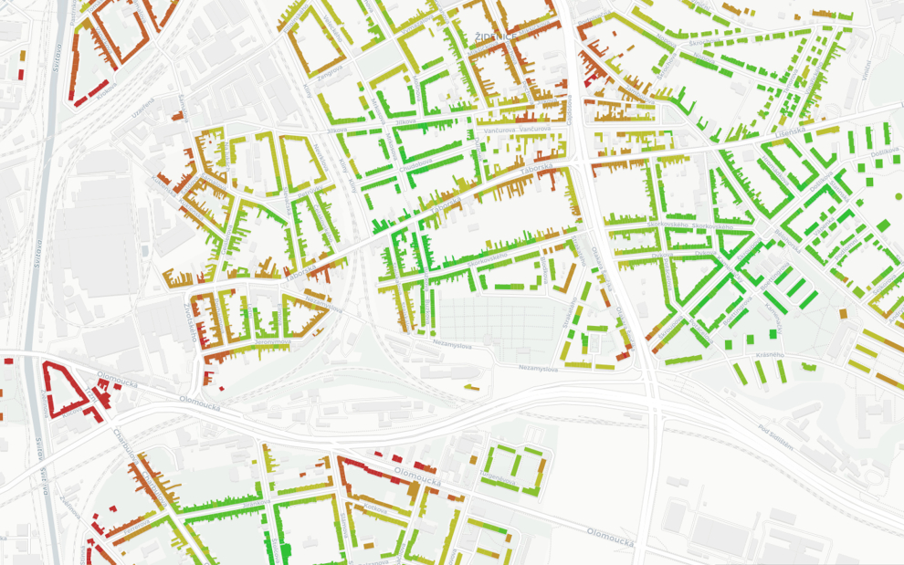{ width=300px }
  <figcaption>Analýza budov na základě technicko-hospodářských atributů</figcaption>
</figure>

V rámci tohoto předmětu se naučíte pracovat s GIS softwarem a daty, provádět prostorové analýzy a vizualizace, modelovat vliv budoucích staveb na okolní prostředí a integrovat GIS do procesu navrhování. Získáte praktické dovednosti, které vám umožní efektivně řešit komplexní úkoly spojené s architekturou a urbanismem. Zabývat se se tedy budeme i tématy jako je analýza dat (např. hledání nejbližších objektů, nejkratších cest, viditelnosti ve 3D, hydrologický odtok apod.), naučíte se využívat GIS pro hodnocení lokalit z hlediska jejich potenciálu pro rozvoj, pro tvorbu územních plánů a pro prezentaci vašich projektů.

  <figure style="margin: 10px; display: flex; flex-direction: column; align-items: center;">
    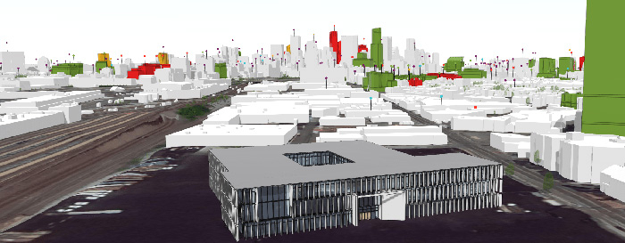
    <figcaption style="text-align: center;">3D model s kombinovanou zástavbou   vytvořenou procedurálně i přesným modelováním</figcaption>
  </figure>
  <figure style="margin: 10px; display: flex; flex-direction: column; align-items: center;">
    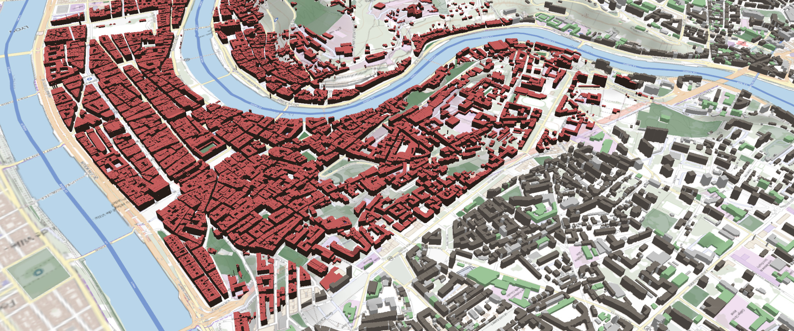
    <figcaption style="text-align: center;">3D zástavba nad digitálním modelem terénu</figcaption>
  </figure>

GIS vám *umožní lépe porozumět kontextu vašeho projektu a navrhnout budovy, které jsou v souladu s okolním prostředím a potřebami komunit*. Budete schopni *efektivněji komunikovat s klienty, developery a dalšími zainteresovanými subjekty*, protože budete mít k dispozici konkrétní data a vizualizace, které podpoří vaše argumenty. GIS vám pomůže optimalizovat náklady projektu, protože budete moci lépe plánovat a předvídat potenciální problémy.
Připojte se k nám a objevte svět prostorové inteligence, který vám otevře nové možnosti pro vaši tvůrčí práci. Získejte konkurenční výhodu na trhu a staňte se *moderním architektem*, který dokáže efektivně využívat moderní technologie pro navrhování lepších budov a měst.

<figure markdown>
  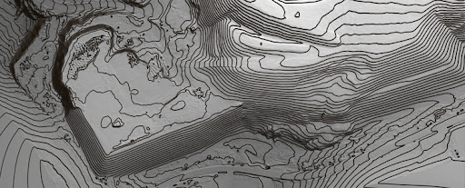{ width=300px }
  <figcaption>Vrstevnice jako 3D linie vhodné k modelování terénu</figcaption>
</figure>

Přednášky vás provedou základní teorií, cvičení se věnují praktickému ovládání GIS software – zejména porozumění práci s daty, provádění analýz a vizualizace dat. Během výuky je používán software __:simple-arcgis: Esri ArcGIS Pro__{: style="white-space: nowrap;"}, částečně  věnován prostor i možným alternativám (program __:simple-qgis: QGIS__).

<h2 style="text-align:center;">Naučíte se</h2>
<!-- styl je zde pridany HTML tagem (ne pomoci '##'), aby se text neobjevil v tabulce obsahu vlevo na strance -->

 <!-- specificky format gridu (trida "grid_icon_info") na miru uvodni strance predmetu -->

-   :material-vector-union:{ .xl }

    **získávat prostorová data**, geodatabáze a další datové zdroje
    
-   :material-vector-polygon:{ .xl }

    __zpracovávat__ a __analyzovat__ prostorová data, porozumět specifikům __vektorů__ a __rastrů__ 

-   :material-creation-outline:{ .xl }

    __tvořit__ a __editovat__ GIS data ve 2D i 3D
    
-   :material-map-outline:{ .xl }

    vytvářet **mapové výstupy a vizualizace**

-   :material-filter-outline:{ .xl }

    __filtrovat__ data pomocí atributových a prostorových dotazů

-   :material-tools:{ .xl }

    aplikovat základní __prostorové funkce__, pracovat s terény a modely

-   :material-vector-difference:{ .xl }

    **kombinovat data** napříč software a platformami

-   :octicons-share-16:{ .xl }

    __sdílet__ data prostřednictvím webu (systém _ArcGIS Online_, webové mapové aplikace)

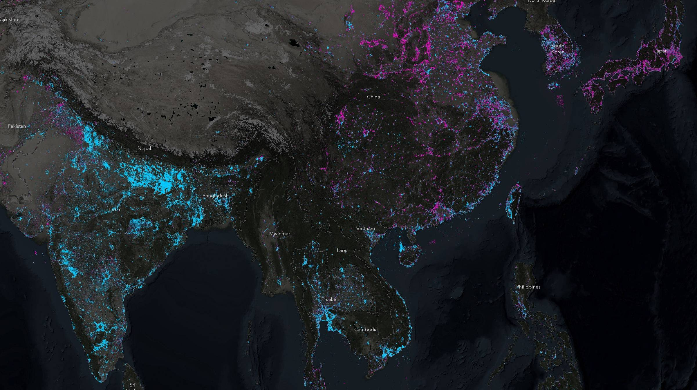{: .no-filter }
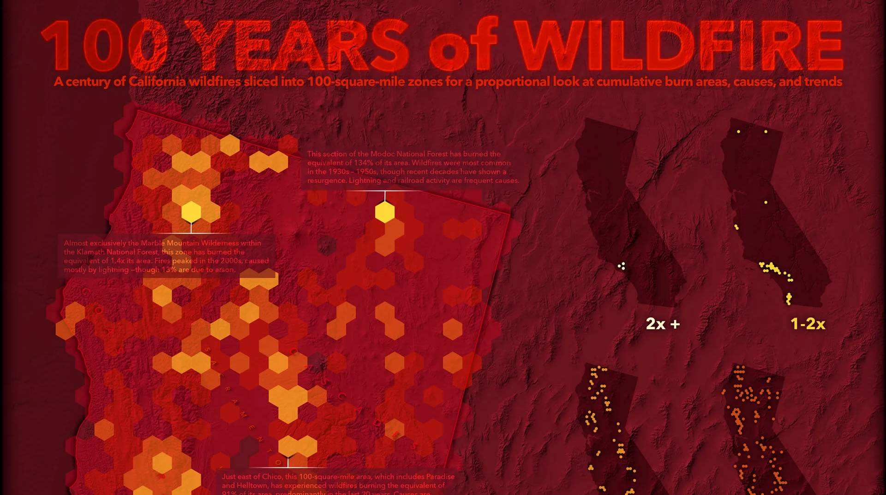{: .no-filter }
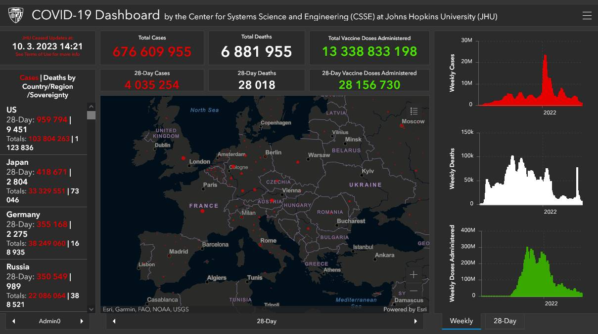{: .no-filter }
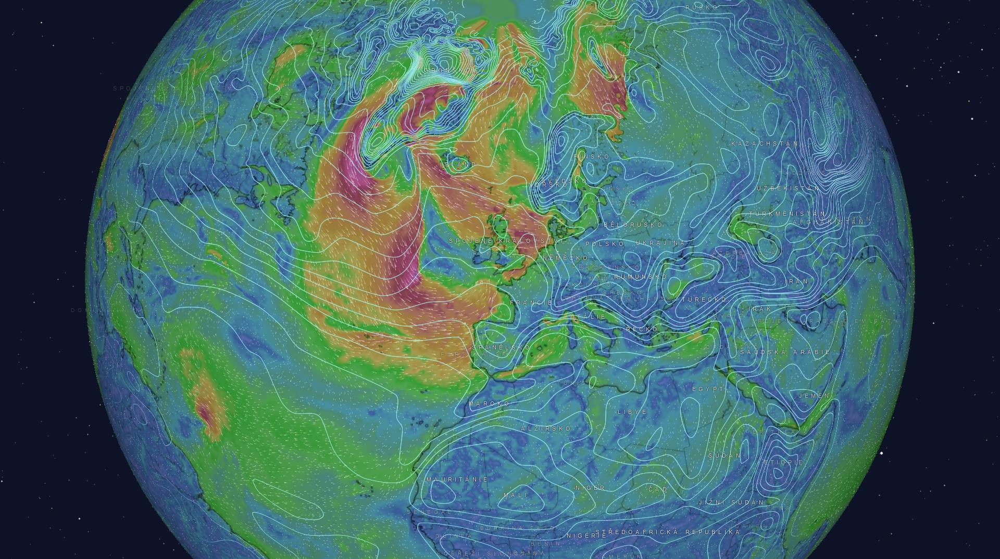{: .no-filter }
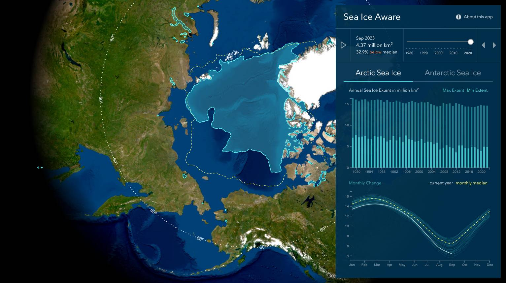{: .no-filter }
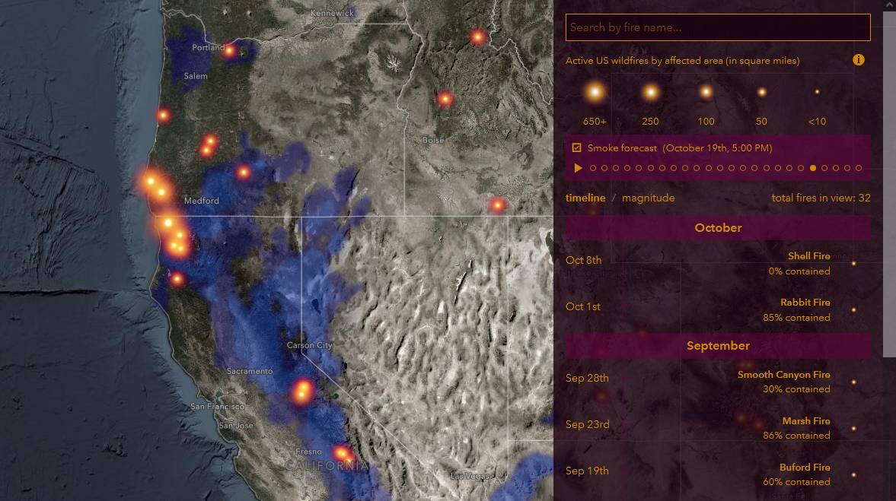{: .no-filter }
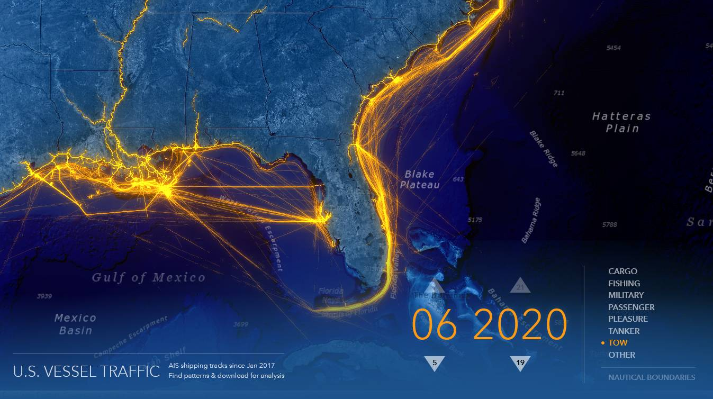{: .no-filter }
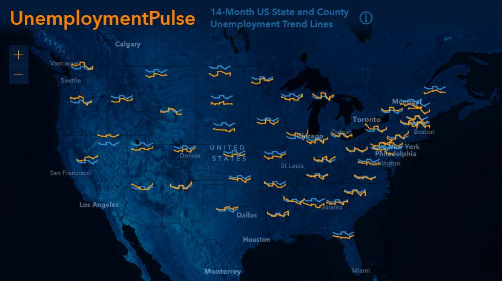{: .no-filter }
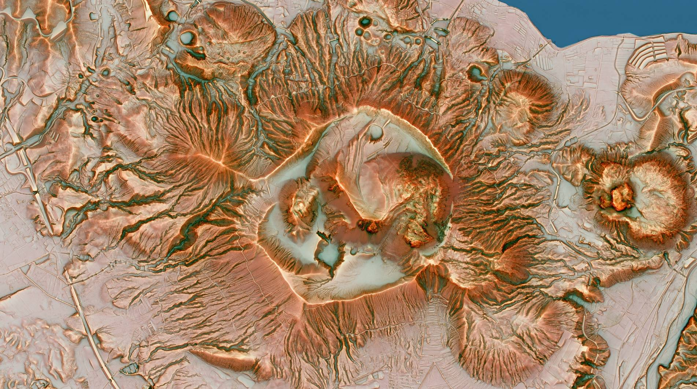{: .no-filter }
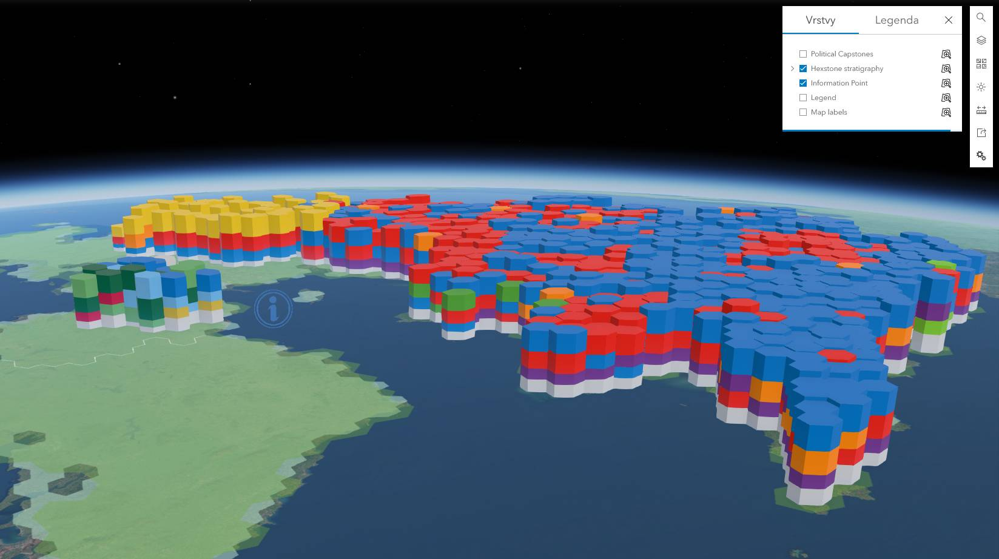{: .no-filter }
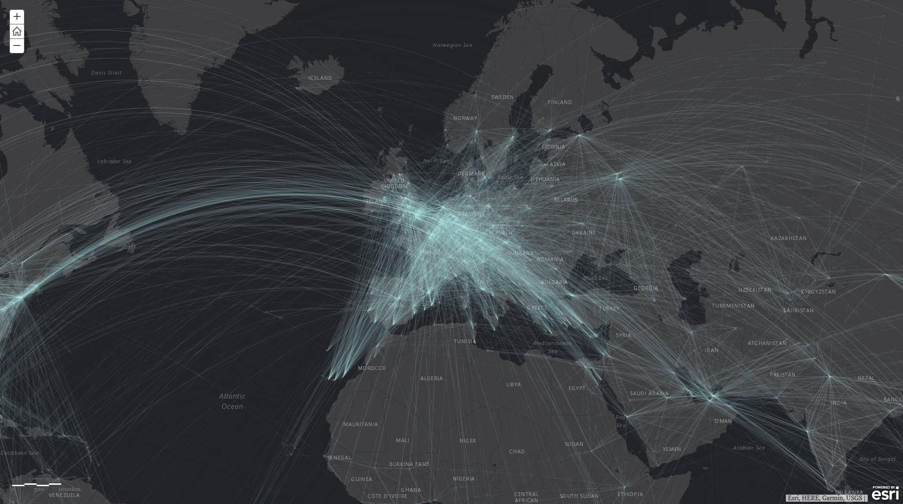{: .no-filter }
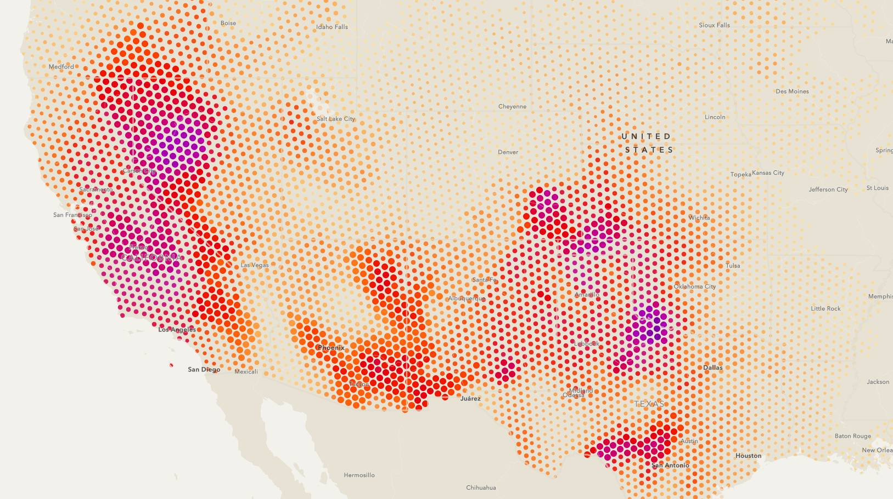{: .no-filter }

 

### **Doporučená literatura**

1. Kolář, J. (1998): Geografické informační systémy 10. Vydavatelství ČVUT, Praha.
2. Rapant, P. (2006): Geoinformatika a geoinformační technologie. VŠB-TU Ostrava, 500 str. ISBN 80-248-1264-9.
3. Břehovský, M., Jedlička, K. (2005): Přednáškové texty pro Úvod do GIS. ZČU Plzeň, 116 s.
4. Hrubý M.: Geografické Informační Systémy (GIS) - Studijní opora. VÚT v Brně, 91 str.
5. Tuček J. (1998): Geografické informační systémy, Praha Computer Press, 1998.
6. Geletič, J., Hladiš, L., Šimáček, P. (2019): [GIS pro geografy. Distanční studijní opora](https://geography.upol.cz/soubory/studium/opory/D_GIS.pdf). Univerzita Palackého v Olomouci, 141 s.

 
