# ArcGIS – Objevte sílu prostorové inteligence ve vašich projektech

Chcete posunout své architektonické vize na novou úroveň? Otevřete bránu k inovativním a efektivním řešením s pomocí geografických informačních systémů (GIS)! Nový volitelný předmět **ArcGIS** vám představí nástroj, díky kterýmu budete moci plně využít potenciál prostorových dat ve své práci.

<figure markdown>
  { width=300px }
  <figcaption>GIS</figcaption>
</figure>

GIS není jen o mapách. Je to mocný nástroj, který vám umožní **analyzovat a interpretovat komplexní prostorové informace**, které jsou nezbytné pro navrhování budov a urbanistických celků. Představte si, že máte k dispozici **podrobné údaje o lokalitě vašeho projektu, včetně informací o terénu, dopravní infrastruktuře, zeleni, ale i sociodemografických datech, slunečním osvitu a mnoha dalších faktorech**. S pomocí GIS můžete tyto informace **efektivně využít pro optimalizaci návrhu, zlepšení energetické účinnosti budov, plánování dopravy a urbanistického rozvoje**. 

<figure markdown>
  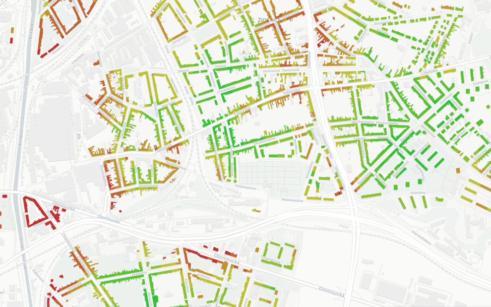{ width=300px }
  <figcaption>Analýza budov na základě technicko-hospodářských atributů</figcaption>
</figure>

V rámci tohoto předmětu se naučíte pracovat s GIS softwarem a daty, provádět prostorové analýzy a vizualizace, modelovat vliv budoucích staveb na okolní prostředí a integrovat GIS do procesu navrhování. Získáte praktické dovednosti, které vám umožní efektivně řešit komplexní úkoly spojené s architekturou a urbanismem. Zabývat se se tedy budeme i tématy jako je analýza dat (např. hledání nejbližších objektů, nejkratších cest, viditelnosti ve 3D, hydrologický odtok apod.), naučíte se využívat GIS pro hodnocení lokalit z hlediska jejich potenciálu pro rozvoj, pro tvorbu územních plánů a pro prezentaci vašich projektů.

  <figure style="margin: 10px; display: flex; flex-direction: column; align-items: center;">
    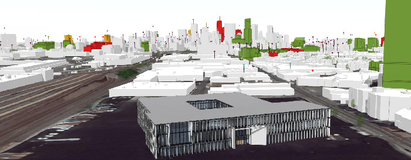
    <figcaption style="text-align: center;">3D model s kombinovanou zástavbou   vytvořenou procedurálně i přesným modelováním</figcaption>
  </figure>
  <figure style="margin: 10px; display: flex; flex-direction: column; align-items: center;">
    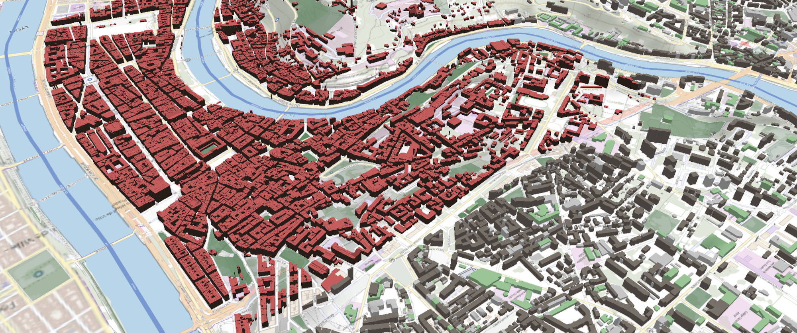
    <figcaption style="text-align: center;">3D zástavba nad digitálním modelem terénu</figcaption>
  </figure>

GIS vám **umožní lépe porozumět kontextu vašeho projektu a navrhnout budovy, které jsou v souladu s okolním prostředím a potřebami komunit**. Budete schopni **efektivněji komunikovat s klienty, developery a dalšími zainteresovanými subjekty**, protože budete mít k dispozici konkrétní data a vizualizace, které podpoří vaše argumenty. GIS vám pomůže optimalizovat náklady projektu, protože budete moci lépe plánovat a předvídat potenciální problémy.
Připojte se k nám a objevte svět prostorové inteligence, který vám otevře nové možnosti pro vaši tvůrčí práci. Získejte konkurenční výhodu na trhu a staňte se **moderním architektem**, který dokáže efektivně využívat moderní technologie pro navrhování lepších budov a měst.

<figure markdown>
  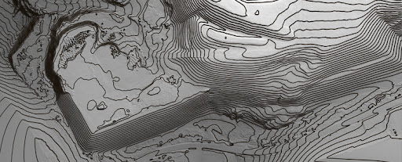{ width=300px }
  <figcaption>Vrstevnice jako 3D linie vhodné k modelování terénu</figcaption>
</figure>

V předmětu je kladen důraz zejména na praktickou práci s prostorovými daty, jejich získávání, zpracování, analýzu a vizualizaci. Studenti si na modelových úlohách osvojí základní metody vektorových a rastrových prostorových analýz, práci s digitálními modely terénu, analýzu viditelnosti a 3D vizualizaci. Výuka probíhá převážně v prostředí software __:simple-arcgis: Esri ArcGIS Pro__{: style="white-space: nowrap;"}.

<h2 style="text-align:center;">Naučíte se</h2>
<!-- styl je zde pridany HTML tagem (ne pomoci '##'), aby se text neobjevil v tabulce obsahu vlevo na strance -->

 <!-- specificky format gridu (trida "grid_icon_info") na miru uvodni strance predmetu -->

-   :material-vector-union:{ .xl }

    **získávat prostorová data**, geodatabáze a další datové zdroje
    
-   :material-vector-polygon:{ .xl }

    __zpracovávat__ a __analyzovat__ prostorová data, porozumět specifikům __vektorů__ a __rastrů__ 

-   :material-creation-outline:{ .xl }

    __tvořit__ a __editovat__ GIS data ve 2D i 3D
    
-   :material-map-outline:{ .xl }

    vytvářet **mapové výstupy a vizualizace**

-   :material-filter-outline:{ .xl }

    __filtrovat__ data pomocí atributových a prostorových dotazů

-   :material-tools:{ .xl }

    aplikovat základní __prostorové funkce__, pracovat s terény a modely

-   :material-vector-difference:{ .xl }

    **kombinovat data** napříč software a platformami

-   :octicons-share-16:{ .xl }

    __sdílet__ data prostřednictvím webu (systém _ArcGIS Online_, webové mapové aplikace)

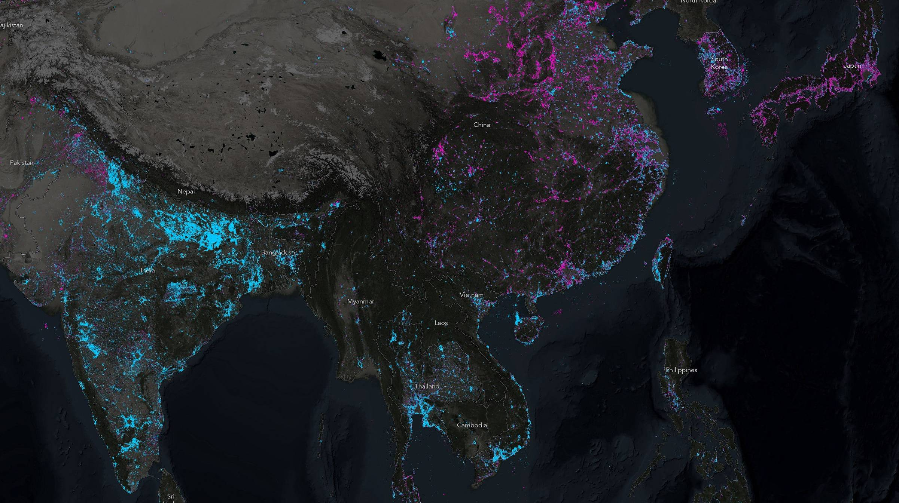{: .no-filter }
{: .no-filter }
{: .no-filter }
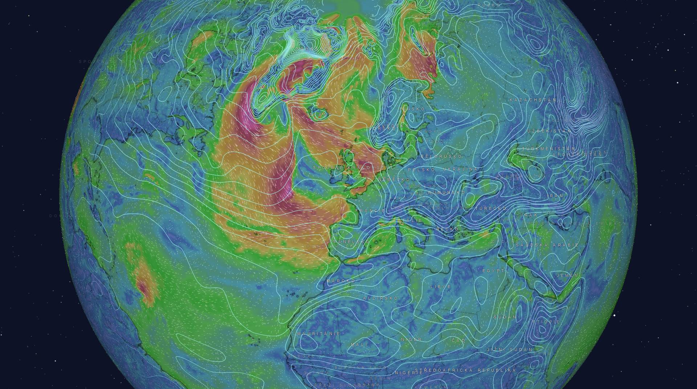{: .no-filter }
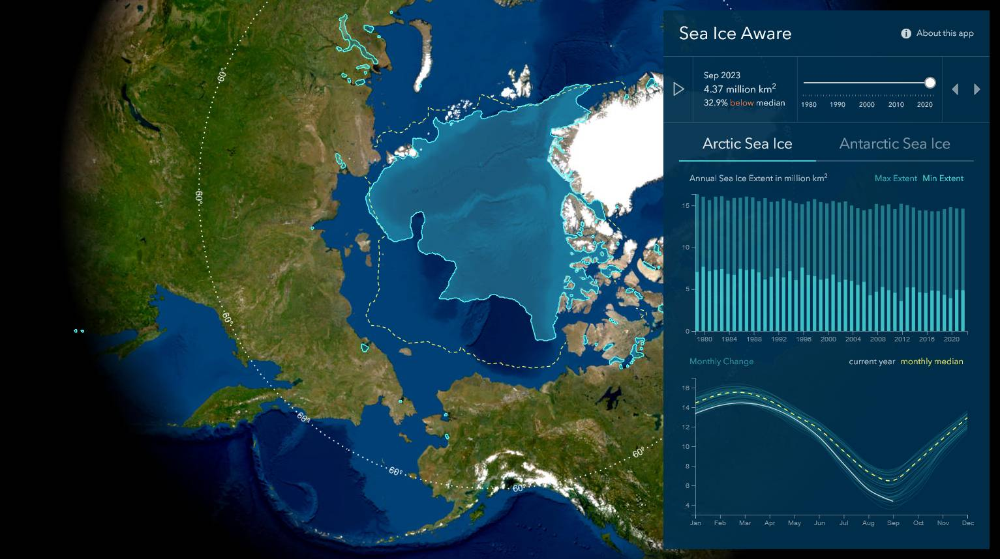{: .no-filter }
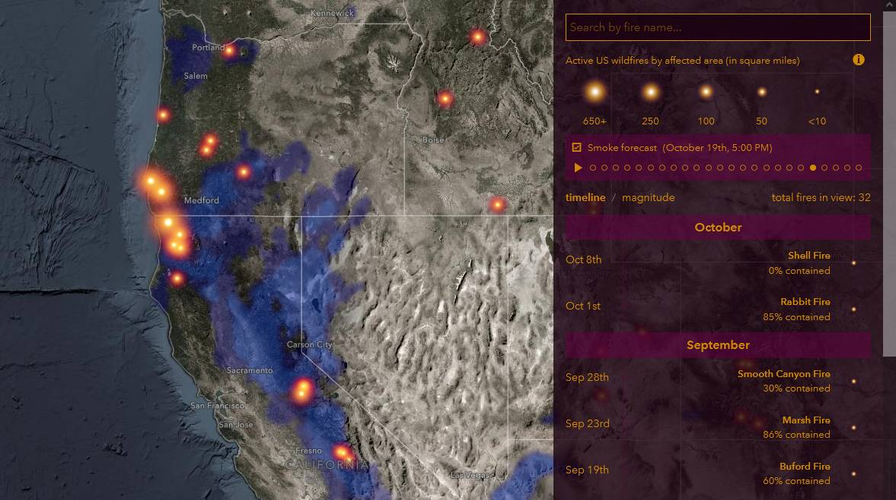{: .no-filter }
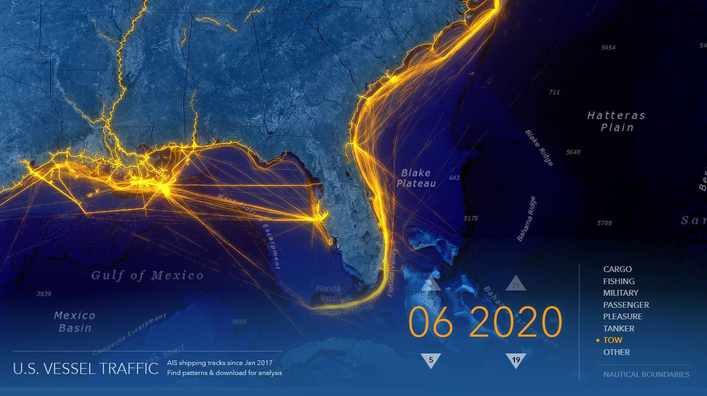{: .no-filter }
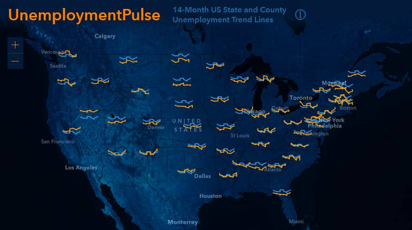{: .no-filter }
{: .no-filter }
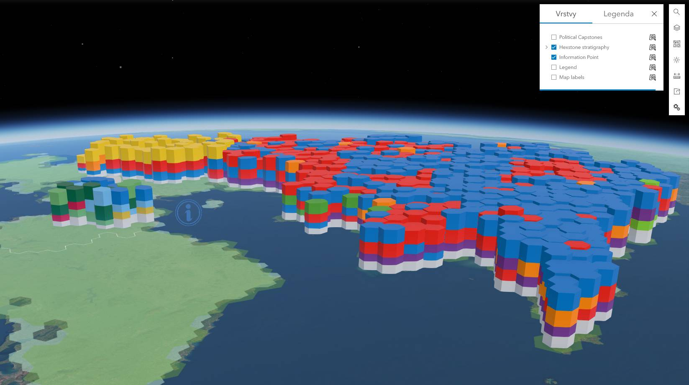{: .no-filter }
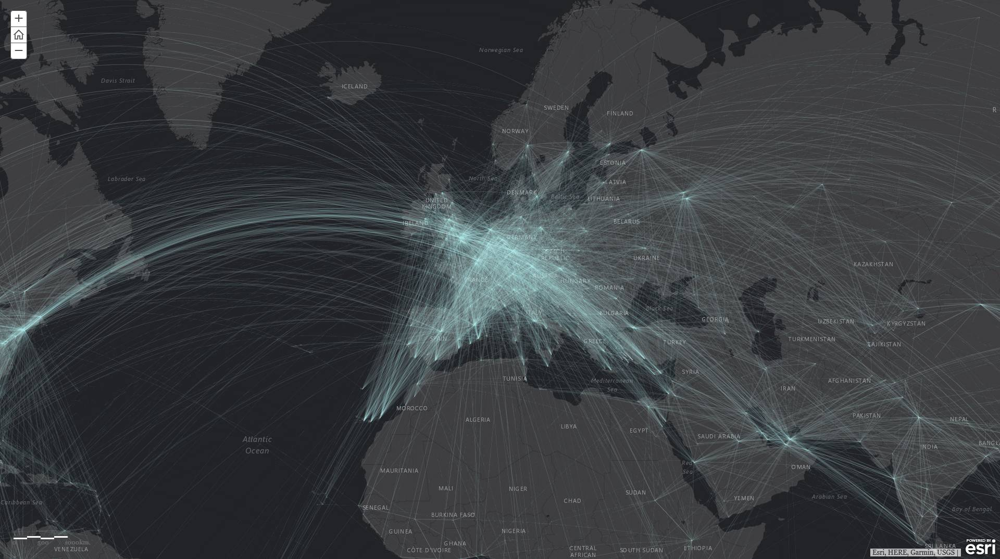{: .no-filter }
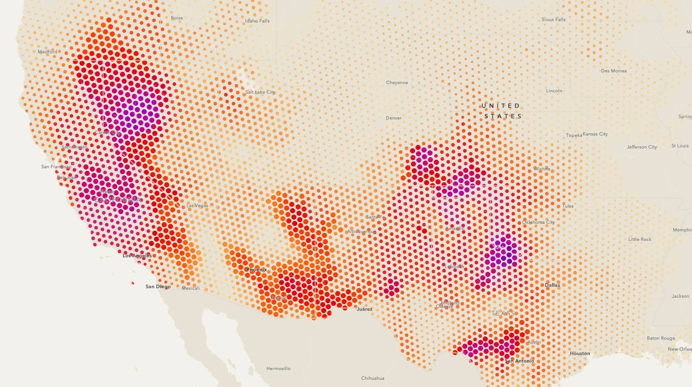{: .no-filter }

 

## **Cvičení** 

účast doporučená
{: style="opacity:50%;margin-top:0;"}

{: .off-glb .no-filter style="height: 1.5em; vertical-align: -.4em; clip-path: circle();"} 
[__Mgr. Petra Justová, Ph.D.__](https://geomatics.fsv.cvut.cz/en/employees/petra-justova/)__&nbsp;__{style="margin-left:1rem;"}
{: .off-glb .no-filter style="height: 1.5em; vertical-align: -.4em; clip-path: circle();"} 
[__Ing. Vojtěch Cehák__](https://geomatics.fsv.cvut.cz/employees/vojtech-cehak/)

[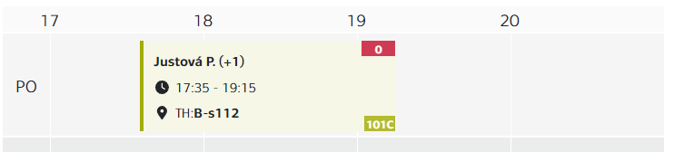{.off-glb .no-filter style="width: 500px;"}](https://kos.cvut.cz/schedule/course/155YGIS/semester/B261){target="_blank"}

| datum | téma | cvičící |
| :---: | ----- | :------: |
| 21.09. | [Úvod do práce v prostředí ArcGIS. Prostorová data – rastry, vektory, datové zdroje](https://k155cvut.github.io/ygis/cviceni/cviceni1/) | VC |
| 28.09. | — odpadá — | — |
| 05.10. | [Vektorová data, atributové dotazy, prostorové dotazy](https://k155cvut.github.io/ygis/cviceni/cviceni2/) + [Analýza lokality pro výstavbu skládky, část 1](https://k155cvut.github.io/ygis/semestralka/#skladka) | PJ |
| 12.10. | [Rastrová data, Výškové rastry, TIN, vrstevnice](https://k155cvut.github.io/ygis/cviceni/cviceni6/) | PJ |
| 19.10. | [Prostorové funkce (geoprocessing), spatial join](https://k155cvut.github.io/ygis/cviceni/cviceni3/) + [Analýza lokality pro výstavbu skládky, část 2](https://k155cvut.github.io/ygis/semestralka/#skladka) | PJ |
| 26.10. | [Analýza lokality pro výstavbu skládky, část 3](https://k155cvut.github.io/ygis/semestralka/#skladka) + tvorba mapového výstupu (část 1) | PJ |
| 02.11. | [Analýzy viditelnosti](https://k155cvut.github.io/ygis/semestralka/#rozhledna) | PJ |
| 09.11. | [3D data, reprezentace dat ve 3D prostoru (část 1)](https://k155cvut.github.io/ygis/cviceni/cviceni8/) | VC |
| 16.11. | — odpadá — | — |
| 23.11. | [3D data, reprezentace dat ve 3D prostoru (část 2)](https://k155cvut.github.io/ygis/cviceni/cviceni8/) | VC |
| 30.11. | Publikace 3D dat do webového prostředí | VC |
| 07.12. | [Topografická analýza povrchu, reklasifikace rastrových dat](https://k155cvut.github.io/ygis/cviceni/cviceni7/) + [Analýza lokality pro výstavbu solární elektrárny](https://k155cvut.github.io/ygis/semestralka/#solarni-elektrarna) | PJ |
| 14.12. | [Analýza lokality pro výstavbu solární elektrárny, část 2](https://k155cvut.github.io/ygis/semestralka/#solarni-elektrarna) + tvorba mapového výstupu (část 2) | PJ |

### **Podmínky zápočtu**

Každý student odevzdává jeden mapový poster formátu A3 či webovou mapovou aplikaci / story mapu / 3D scénu, kde budou prezentovány výsledky jedné z [modelových úloh](/semestralka) dle vlastního výběru. Modelové úlohy jsou zpracovány v průběhu praktických cvičení a jsou tak z převážné části zpracovány během výuky.

Termín odevzdání: __neděle 31. ledna 2027__{.outlined} 

## **Doporučené zdroje**
### **Literatura**

1. Kolář, J. (1998): Geografické informační systémy 10. Vydavatelství ČVUT, Praha.
2. Rapant, P. (2006): Geoinformatika a geoinformační technologie. VŠB-TU Ostrava, 500 str. ISBN 80-248-1264-9.
3. Břehovský, M., Jedlička, K. (2005): Přednáškové texty pro Úvod do GIS. ZČU Plzeň, 116 s.
4. Hrubý M.: Geografické Informační Systémy (GIS) - Studijní opora. VÚT v Brně, 91 str.
5. Tuček J. (1998): Geografické informační systémy, Praha Computer Press, 1998.
6. Geletič, J., Hladiš, L., Šimáček, P. (2019): [GIS pro geografy. Distanční studijní opora](https://geography.upol.cz/soubory/studium/opory/D_GIS.pdf). Univerzita Palackého v Olomouci, 141 s.

### **Tutoriály**

1. Webové stránky předmětu [GIS1](https://k155cvut.github.io/gis-1/)
2. Webové stránky předmětu [GIS2](https://k155cvut.github.io/gis-2/)
3. [Learn ArcGIS Hub](https://learn.arcgis.com/en/gallery/#?p=arcgispro)
4. [Esri Training Catalog](https://www.esri.com/en-us/training/catalog/all-training)
5. [MOOCs and Live Training Seminars](https://www.esri.com/en-us/training/catalog/live-training-seminars-moocs)
6. [Urban Planning, Design & Development Software](https://www.esri.com/en-us/arcgis/products/arcgis-urban/overview)

---

[Stránka předmětu v :custom-kos-logo-img-BW:{.middle style="margin-left:3px;"} :custom-kos-logo-BW:{.xl .middle}](https://kos.cvut.cz/course-syllabus/155YGIS/B261){ .md-button .md-button--primary target="_blank"}
{align=center}