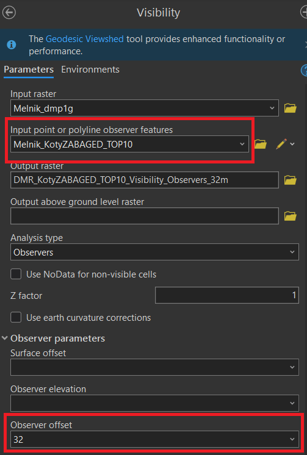

# Semestrální práce – Analýza území

## Zadání

Připravte tištěný mapový poster či webovou mapovou aplikaci, který/á se bude věnovat analýze území dané ORP (viz výše) s ohledem na vhodnost stavby tří objektů:

- nová **solární elektrárna** :material-solar-power-variant:{ .lg .middle } ,
- nová **rozhledna** :material-tower-fire:{ .lg .middle },
- nová **skládka** :material-dump-truck:{ .lg .middle }.

??? task-fg-color "Individuální zadání"
    <iframe src="https://docs.google.com/spreadsheets/d/e/2PACX-1vQfN5ojqTC5jXvkKUlyuNzHbgnunUQHZ2tbxWmFeYRKKgx-a3Mq3v2FXlNcAX9ebQ/pubhtml?gid=967359062&single=true" width="100%" height="300" frameBorder="0"></iframe>

### :material-solar-power-variant:{ .lg .middle } **SOLÁRNÍ ELEKTRÁRNA**

V zadaném ORP identifikujte **vhodné plochy pro výstavbu solární elektrárny**{style="text-transform:uppercase;"}.

Při analýze zohledněte následující hodnoticí kritéria:

- :material-slope-uphill:{ .lg .middle } **Sklonitost svahu:** Pro instalaci solárních panelů jsou vhodné zejména rovinaté nebo mírně svažité terény.

| Sklonitost | Bodové ohodnocení  |
|---|---------------------------|
| 0–1° | 3 |
| 1–4° | 2 |
| 4–7° | 1 |
| >7° | 0 |

- :material-sun-angle:{ .lg .middle } **Orientace svahu:** Pro instalaci solárních panelů jsou vhodné zejméne plochy orientované na jih, jihovýchod nebo jihozápad.

| Orientace svahu | Bodové ohodnocení  |
|---|---------------------------|
| azimut 0°–112,5° | 0 |
| azimut 112,5°–135° (VJV-JV)| 1 |
| azimut 135°–157,5° (JV-JJV) | 2 |
| azimut 157,5°–202,5° (JJV-J-JJZ) | 3 |
| azimut 202,5°–225°  (JJZ-JZ)| 2 |
| azimut 225°–247,5° (JZ-ZJZ) | 1 |
| azimut 247,5°–360° | 0 |

- :material-island-variant:{ .lg .middle } **Typ využití půdy:** Pro výstavbu solární elektrárny jsou vhodné např. trvalé travní porosty, solární elektrárnu je však možné vybudovat i na orné půdě. 

| Typ využití půdy | Bodové ohodnocení  |
|---|---------------------------|
| louka, trvalý travní porost | 3 |
| orná půda   | 1 |
| ostatní typy | 0 |

Plocha pro výstavbu solární elektrárny je považována za vhodnou, pokud má **rozlohu více než 1 ha** a její celkové bodové ohodnocení dosahuje **min. 7 bodů**.

Z výsledků analýzy vyberte **3 nejvhodnější lokality pro výstavbu solární elektrárny**{style="text-transform:uppercase;"} dle jejich celkové rozlohy a bodového ohodnocení. Ve finálním výběru prioritizujte lokality, které mají nejvyšší bodové ohodnocení. 

Vytvořte přehlednou vizualizaci zobrazující vybrané lokality. Ve výsledné vizualizaci uveďte pro jednotlivé lokality následující atributy: plocha v hektarech, celkové bodové ohodnocení.

- **DATOVÉ ZDROJE:**

    [:material-layers: DMR5G ](https://ags.cuzk.gov.cz/arcgis2/rest/services/dmr5g/ImageServer){ .md-button .md-button--primary .button_smaller target="_blank"}
    [:material-layers: ZABAGED ]("disk S, adresář K155\Public\data\ArcGIS\ --> vrstvy 'OrnaPudaAOstatniDaleNespecifikovanePlochy', 'TrvalyTravniPorost'' "){ .md-button .md-button--primary .button_smaller}
    {: .button_array style="justify-content:flex-start;"}

???+ task-fg-color "Jak na to?"
    
    1. připravte si DMR5G pro své území
        - *Add Data From Path* --> *Data-Export Raster* __(1)__{title="nastavení parametrů funkce Export Raster"} --> *Extract by Mask* __(2)__{title="nastavení parametrů funkce Extract by Mask"}
    2. připravte si polygonové vrstvy ``OrnaPudaAOstatniDaleNespecifikovanePlochy`` a ``TrvalyTravniPorost`` ze [**ZABAGED**]("disk S, adresář K155\Public\data\ArcGIS\ ") pro své území
        - z vrstvy ``OrnaPudaAOstatniDaleNespecifikovanePlochy``vyberte pouze požadované typy ploch *(Select By Attributes)* 
        - ořízněte vrstvy dle hranic ORP *(Clip)*
        - jednotlivé vrstvy spojte do jedné vrstvy *(Merge)* 
        - v atributové tabulce nově vzniklé vrstvy vytvořte nový atribut ``hodnoceni`` *(Add Field)*--> hodnoty pro jednotlivé typy ploch vyplňte dle zadaných kritérií *(Calculate Field)*
        - polygonovou vrstvu převeďte na rastr *(Feature to Raster)* __(3)__{title="nastavení parametrů funkce Feature to Raster"} __(4)__{title="nastavení Environments funkce Feature to Raster"}
    3. vytvořte rastry sklonitosti *(Slope)* a orientace svahů *(Aspect)* (nezapomeňte v *Environments* nastavit parametry *Output Coordinate System*, *Cell Size* a *Snap Raster*)
    4. proveďte reklasifikaci rastrů sklonitosti a orientace svahů dle zadaných kritérií *(Reclassify)* __(5)__{title="nastavení parametrů nástroje Reclassify pro rastr orientace svahů"}
    5. zkombinujte rastry využití plochy, sklonitosti a orientace svahů do jednoho rastru, jež bude území ORP klasifikovat dle bodového hodnocení zadaných podmínek *(Raster Calculator)* __(6)__{title="nástroj Raster Calculator"}
    6. výstupní rastr opět reklasifikujte, aby zobrazoval pouze území vhodné pro výstavbu solární elektrárny (minimálně 7 bodů)
    7. převeďte rastr na polygonovou vrstvu *(Raster to Polygon)* a vyberte pouze území splňující zadané kritérium, které je větší než 1 ha *(Select By Attributes)*
    8. polygonovou vrstvu vhoďte upravte *(Eliminate Polygon Part)* a vizualizujte *(Symbology)*

### :material-tower-fire:{ .lg .middle } **ROZHLEDNA**

Z 5 nejvyšších výškových bodů v zadaném ORP identifikujte **nejvhodnější lokalitu pro výstavbu rozhledny**{style="text-transform:uppercase;"}. Hlavním kritériem výběru lokality je viditelnost co největší plochy zadaného ORP. Maximální přípustná výška stavby je 35 m, přičemž pozorovací ochoz je ve výšce 32 m. Zjistěte, jaká je viditelnost významných budov (kostel, zámek, hrad).

Na základě výsledků analýzy vytvořte 3D scénu zobrazující vhodné lokality pro výstavbu rozhledny s modelovanou viditelností. Ve scéně můžete libovolně vyznačit budovy či významné krajinné prvky, které jsou z dané lokality viditelné. Volitelně můžete namodelovat i samotnou stavbu rozhledny.

- **DATOVÉ ZDROJE:**

    [:material-layers: DMP1G ](https://ags.cuzk.gov.cz/arcgis2/rest/services/dmp1g/ImageServer){ .md-button .md-button--primary .button_smaller target="_blank"}
    [:material-layers: Data50 ]("''KotovanyBod', 'Kostel', 'VezovitaStavba', 'Zamek', 'Zricenina', 'Hrad''"){ .md-button .md-button--primary .button_smaller}
    [:material-layers: ZABAGED ]("''KotovanyBod', 'BudovaJednotlivaNeboBlokBudov''"){ .md-button .md-button--primary .button_smaller}
    {: .button_array style="justify-content:flex-start;"}

???+ task-fg-color "Jak na to?"
    
    1. připravte si DMP1G pro své území
        - *Add Data From Path* --> *Data-Export Raster* __(12)__{title="nastavení parametrů funkce Export Raster"} --> *Extract by Mask* __(13)__{title="nastavení parametrů funkce Extract by Mask"}
    2. připravte si bodovou vrstvu ``KotovanyBod`` ze [**ZABAGED**]("disk S, adresář K155\Public\data\ArcGIS\ ") nebo [**Data50**]("disk S, adresář K155\Public\data\ArcGIS\ ") pro své území
        - ořízněte vrstvu dle hranic ORP *(Clip)* nebo vyhledejte výškové kóty na základě polohy *(Select By Location)* __(7)__{title="výběr prvků na základě polohy"}
        - v atributové tabulce vrstvy vyberte pouze 5 nejvyšších kót ve Vašem ORP a vytvořte novou vrstvu *(Data-Export Features)*
    3. vytvořte rastr viditelnosti pro vrstvu s 5 výškovými kótami *(Visibility)* (nezapomeňte v *Observer parameters* nastavit parametr *Observer offset* dle výšky pozorovatele na plošině rozhledny) __(8)__{title="nastavení parametrů funkce Visibility"}
    4. vyberte lokalitu, ze které je vidět největší plocha Vašeho území
        - pro jednotlivé výškové kóty (OBSXY) postupně sumarizujte počet viditelných pixelů *(název atributu-Summarize)* __(9)__{title="nastavení funkce Summary Statistics"} 
        - dle jednotlivých sumarizačních tabulek určete, která lokalita má pro hodnotu "1" největší počet pixelů __(10)__{title="počet pixelů viditelných z dané lokality"}
    5. vytvořte vizualizaci rastru viditelnosti pro vybranou lokalitu
        - v nastavení symbologie vrstvy nastavte *Primary symbology-Unique Values* dle atributu vybraného lokality (např. OBS1) __(11)__{title="nastavení symbologie rastru viditelnosti"}

### :material-dump-truck:{ .lg .middle } **SKLÁDKA**

V zadaném ORP identifikujte **vhodné plochy pro výstavbu skládky**{style="text-transform:uppercase;"}.

V primární fázi analýzy zohledněte následující podmínky:

| Podmínka | Vzdálenost/hodnota |
|---|---------------------------|
| Plocha | min. 1 ha |
| Krajinný pokryv | trvalý travní porost |
| Záplavové území | mimo Q20 a nižší |
| Vzdálenost od vodního toku nebo plochy | min.	200 m |
| Vzdálenost od OPVZ a OPVN | min. 200 m |
| Vzdálenost od stavebního objektu   (`zpusobvyuzitikod = 2,3,4,5,6,7,8,9,10,11,13,14,15`) | min. 300 m |
| Vzdálenost od MZChÚ či OP MZChÚ | min. 300 m |

Z výsledků primární fáze analýzy vyberte **3 nejvhodnější lokality pro výstavbu skládky**{style="text-transform:uppercase;"} dle jejich vzdálenosti od pozemní komunikace a lesa. Ve finálním výběru prioritizujte lokality, které se nachází co nejdále od lesa, ale zároveň nejsou příliš vzdáleny od pozemní komunikace (silnice III. třídy a vyšší).

Vytvořte přehlednou vizualizaci zobrazující vybrané lokality. Ve výsledné vizualizaci uveďte pro jednotlivé lokality následující atributy: plocha v hektarech, vzdálenost od nejbližší silnice a lesa v metrech.

<figure markdown>
  { width=600px }
  <figcaption>Ukázka vizualizace analýzy pro výstavbu skládky v ORP Mělník</figcaption>
</figure>

- **DATOVÉ ZDROJE:**

    [:material-layers: HEIS VÚV ](https://ags.cuzk.gov.cz/arcgis2/rest/services/dmp1g/ImageServer){ .md-button .md-button--primary .button_smaller target="_blank"}
    [:material-layers: AOPK ]("''KotovanyBod', 'Kostel', 'VezovitaStavba', 'Zamek', 'Zricenina', 'Hrad''"){ .md-button .md-button--primary .button_smaller}
    [:material-layers: ZABAGED ]("''KotovanyBod', 'BudovaJednotlivaNeboBlokBudov''"){ .md-button .md-button--primary .button_smaller}
    {: .button_array style="justify-content:flex-start;"}

<!-- původní zadání (B241)

|TYP PODMÍNKY| VZDÁLENOST NEBO HODNOTA                     |
|---|---------------------------|
| Plocha | min. 1 ha |
| Půdy | jíl nebo jiná nepropustná hornina |
| Hladina podzemní vody | území s nízkou hladinou podzemní vody |
| Záplavové území | mimo Q20 a nižší |
| Sklonitost terénu | do 4,5° sklonu  |
| Vzdálenost od vodního toku nebo plochy | min.	200 m |
| Vzdálenost od stavebního objektu   (`zpusobvyuzitikod = 2,3,4,5,6,7,8,9,10,11,13,14,15`) | min. 300 m |
| Vzdálenost od MZChÚ | min. 300 m |
| Vzdálenost od ChOPAV | min. 500 m |
| Vzdálenost k pozemním komunikacím | silnice III. tř. a vyšší max. 250 m daleko | -->

1.  { .no-filter width=500px} nastavení parametrů funkce Export Raster
2.  { .no-filter width=500px} nastavení parametrů funkce Extract by Mask
3.  { .no-filter width=500px} nastavení parametrů funkce Feature to Raster
4.  { .no-filter width=500px} nastavení Environments funkce Feature to Raster
5.  { .no-filter width=500px} nastavení parametrů nástroje Reclassify pro rastr sklonitosti
6.  { .no-filter width=500px} nástroj Raster Calculator
7.  { .no-filter width=500px} výběr prvků na základě polohy
8.  { .no-filter width=500px} nastavení parametrů funkce Visibility
9.  { .no-filter width=500px} nastavení funkce Summary Statistics
10. { .no-filter width=500px} počet pixelů viditelných z dané lokality
11. { .no-filter width=500px} nastavení symbologie rastru viditelnosti
12.  { .no-filter width=500px} nastavení parametrů funkce Export Raster
13.  { .no-filter width=500px} nastavení parametrů funkce Extract by Mask

## Výstup

???+ note-grey "Základní parametry semestrální práce"
    - Výstup bude odevzdán ve formě tištěného mapového posteru velikosti min. **A2** nebo v podobě webové mapové aplikace.
    - Kromě vizualizace provedených analýz by měl poster/webová mapová aplikace obsahovat základní charakteristiku území ORP (rozloha, počet obyvatel a slovní popis území).
    - Výstupy analýz budou doprovozeny textem interpretujícím výsledky.

Termín prezentace: __čtvrtek 18. prosince__{.outlined} 

<!--

Nad zadaným územím proveďte následující analýzy s využitím GIS softwaru. Výsledky jednotlivých úloh následně publikujte formou webové mapové aplikace na ArcGIS Online či pomocí open-source řešení (např. GISQuick). Tato aplikace může mít libovolnou formu, takovou, kterou uznáte za vhodnou či zajímavou (ArcGIS Instant Apps, Story Maps, Experience Builder,...). 

Svou aplikaci na konci semestru **30.4.2024** krátce odprezentujete před ostatními v 5 minutové prezentaci. 

Dotazy či připomínky k semestrální práci směřujte sem: *frantisek.muzik@fsv.cvut.cz*

**Pro zadané území vypracujte následující úkoly:**

**1.** Zjistěte v jaké obci se nachází zadaný definiční bod. Z databáze RÚIAN tuto obec vyberte a vyexportujte ji do samostatné vrstvy.

**2.** Určete počet adresních míst na území dané obce (zdroj: RÚIAN).

**3.** Zjistěte, zda se na území zadané obce a v 10 km kolem ní nachází chráněné území (zdroj: ZABAGED). Pokud ano, zobrazte jej v mapě jako samostatnou vrstvu. 

**4.** Vytvořte samostatnou vrstvu, která bude obsahovat data způsobu využití pozemku (zdroj: RÚIAN – vrstva *Parcela*). Na základě atributů v tabulce níže vypočítejte pro data nový sloupec *TYP_VYUZITI*, na základě kterého vrstvu následně vhodně vizualizujte. Číselníky pro přiřazení kódů: [Způsob využití pozemku](https://www.cuzk.cz/Katastr-nemovitosti/Poskytovani-udaju-z-KN/Ciselniky-ISKN/Ciselniky-k-nemovitosti/Zpusob-vyuziti-pozemku.aspx), [Kód druhu pozemku](https://www.cuzk.cz/Katastr-nemovitosti/Poskytovani-udaju-z-KN/Ciselniky-ISKN/Ciselniky-k-nemovitosti/Druh-pozemku.aspx). Závěrem proveďte *Dissolve* dle atributu *TYP_VYUZITI*.

|  Typ využití pozemku *TYP_VYUZITI* (vypočtené)       | Kód druhu pozemku *SC_D_POZEMKU*        | Způsob využití pozemku *SC_ZP_VYUZITI_POZ*            
| ------------ | ------------------------- |----------------|
| orná půda    | 2 | -|
| lesní půda | 10 |  -|
| trvalý travní porost   | 7, 8 | -|
| zahrada    | 5, 6 | -|
| vodstvo   | 11 | -|
| zastavěná plocha     |  13  | *Null* |
| nádvoří     |  13  | *Not Null* |
| komunikace   | 3, 4 , 14 | 14, 15, 16, 17|
| ostatní   | 3, 4 , 14 | vše kromě 14, 15, 16, 17|

???+ note "&nbsp;Poznámka"
      V případě určování typu využití pozemku (sloupec *TYP_VYUZITI*) pro atributy *ostatní* a *komunikace* musí platit výběr prvků ze sloupců *Kód druhu pozemku* a *Způsob využití pozemku* zároveň (tedy využití *AND* ve funkci *Select by attributes*).

**5.** Georeferencujte rastry Státní mapy 1 : 5 000 – odvozené (SMO5) z 50. let 20. století. Najdete je na disku S. Georeferencujte pouze rastry, kterých se dotýká území v okruhu 500 metrů od definičního bodu obce. Ten vypočítejte jako těžiště polygonu obce (musí být uvnitř polygonu). Z georeferencovaných rastrů vytvořte mozaiku. Rastrovou mapu SMO5 neexportujte do výsledné webové aplikace.

**6.** Na podkladu SMO5 vektorizujte území v okruhu 500 metrů od definičního bodu obce. Tato data slučte na základě typů využití ploch (funkce Dissolve). 

Rozlišujte následující typy využití ploch (stejně jako v bodě 5 pro data z RÚIAN): 

- orná půda

- lesní půda

- trvalý travní porosty (louky, pastviny)

- zahrada

- vodstvo (řeky, potoky, rybníky), nevektorizujte malé vodní toky vyznačené pouze liniově

- zastavěná plocha

- nádvoří (okolí domů, neoznačené zahrady, veřejné prostory v intravilánu)

- komunikace (cesty, silnice, železnice)

- ostatní lomy, neúrodná půda apod.

<figure markdown>
{ width="600" }
    <figcaption>Značkový klíč SMO5</figcaption>
</figure>

**7.** Vektorizaci SMO5 topologicky zkontrolujte dle pravidel *Must Not Have Gaps (Area)*, *Must Not Overlap With (Area-Area)* a *Must Not Overlap (Area)*.

**8.** Ve výsledné aplikaci porovnejte vývoj využití krajiny v 50. letech 20. století (vektorizace z SMO5) se současností (RÚIAN – vrstva *Parcela*). Způsob porovnání zvolte dle vlastního uvážení (posuvník v aplikaci, nová vrstva s vypočtenými rozdíly apod.).

**9.** Jako samostatnou vrstvu do svého projektu připojte WMS, WMTS či WFS službu dle vašeho výběru (např. historickou mapu, ortofoto či katastrální mapu). Tato vrstva musí být součástí výsledné mapové aplikace.

## Konkrétní zadání
Bude rozesláno emailem.

-->

